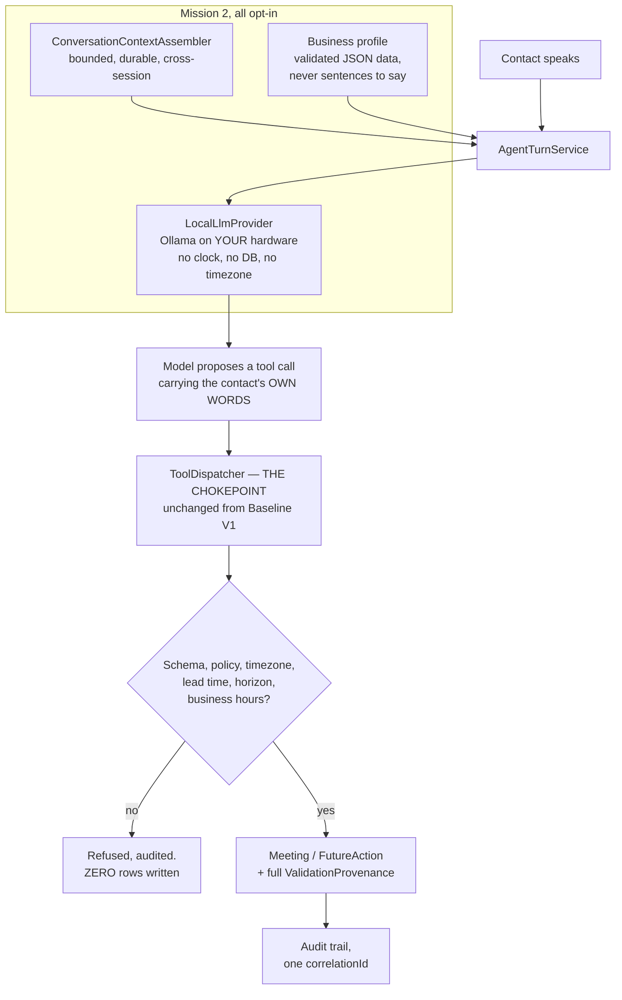

# Schedule AI Voice — Founder Review: Mission 2, Local AI Brain

**Mission:** MISSION-2-LOCAL-BRAIN · **Branch under review:**
`task/MISSION-2-LOCAL-BRAIN-INTEGRATOR-FIX-1` (the integrated branch plus the
four QA defect fixes) · as of 2026-09-23 · prepared by the integration/review
task and completed by the post-QA fix task of the Autonomous Development Team

This package is for Founder review before promotion to `master`. **Nothing here
has been merged.** Baseline V1 on `master` is untouched.

> **Provenance of this document, stated up front because it was assembled in two
> passes.** §§ 3–6 and § 11 were written by the review task against
> `task/MISSION-2-LOCAL-BRAIN-AUTO-REVIEW`. That branch was never merged, so the
> integrated result shipped without this document, without the evaluation layer,
> and without the fixes for three of the four defects below — which is what an
> independent QA pass found and what this branch corrects. Where a number or a
> claim has been re-measured on *this* branch, it says so. Where it has not, it
> is the review task's original measurement and is attributed as such.

> **Where this file lives, and where it should live.** It is at the repository
> root rather than in `docs/` because the mission that produced it had no write
> access to `docs/`. **Whoever merges this should move it to
> `docs/FOUNDER_REVIEW_MISSION_2_LOCAL_BRAIN.md`**, alongside
> `docs/FOUNDER_REVIEW.md`, which is where a review package belongs.
> `README.md` points at it in both places.

---

## 0. What you asked for, and the short answer

`docs/BASELINE_V1.md` § 4 recorded your directive: **customer-facing
conversation must not be scripted.** It must be generated, in the moment, from
the current conversation, durable history, contact context, business/product
context, qualification state, previous conversations, tool results and the
current objective — never selected from canned trees or prewritten wording.
Application code keeps all authority over validation, scheduling, timezones,
persistence and external actions.

**That is built, it runs on your own hardware, and it is opt-in.** One command —
`npm run demo:local` — drives a real 7B model through three real turns of a real
conversation, using the real context assembler, the real business profile, the
real nine tools, the real validation chokepoint and the real audit trail. Every
word the agent says is generated; § 6.4 proves it against every string literal in
the source tree.

**Baseline V1 is unchanged, verified by re-running it.** 500 passed / 2 skipped,
601 scenarios / 2,791 applicable checks / 0 violations / 0 network attempts,
determinism byte-identical. Numbers and raw output in § 7.

**Three things you should read before the good news, because they are the
substance of this review:**

1. **The five-model benchmark did not complete, and one candidate finished.**
   The evaluation task's run died partway through the second model. I resumed it;
   § 5 reports exactly what was measured and what was not. **§ 9's recommendation
   is stated at the confidence the evidence actually supports, and no higher.**
2. **Four real defects were found by running the thing rather than by reading
   it** (§ 8.1, § 8.2, § 8.4, § 8.10) — three by the review task and one more by
   an independent QA pass over the integrated branch, which also re-reproduced
   the other three there with real commands. Three of the four cost the agent its
   business context or its memory **with no error anywhere**. The fourth meant a
   conversational turn had **no time limit at all** — on a phone call, that is a
   dead call. **All four are fixed on this branch, and each fix has a repro that
   fails against the code as it was.**
3. **Hebrew scheduling does not work, and it is not the model's fault** (§ 8.3).
   `src/scheduling/naturalLanguage.ts` is English-only. A perfect model cannot
   book a Hebrew time request today.
4. **A correction carried in from QA, because it changes which fix is right**
   (§ 8.1). Three files in this repository said Ollama truncates an over-long
   prompt from the front and strips the system prompt's guardrail clauses. It
   does not. It drops whole older **messages** and keeps the system prompt — so
   the guardrails are safe and **the conversation history is what is silently
   destroyed**, which lands the defect on this mission's own central claim rather
   than beside it. Demonstrated with a canary, independently reproduced here, and
   corrected everywhere it appeared.

---

## 1. Run it yourself

Node 20+. For § 1.1 you need nothing at all. For § 1.2 you need Ollama.

### 1.1 Baseline V1 — no credentials, no network, no services

```bash
cd .worktrees/MISSION-2-LOCAL-BRAIN-AUTO-REVIEW    # or clone the branch fresh
npm ci
npm run db:generate && npm run db:push && npm run db:seed

npm run typecheck
npm run build
npm test
npm run verify
npm run qa:sweep
npm run qa:sweep -- --determinism
npm run slice:demo
```

`OPENAI_API_KEY` is **not required** for any of it, and is still empty in
`.env.example`. No vendor API is called anywhere in this repository.

### 1.2 The local brain — needs Ollama on the host

```bash
ollama pull qwen2.5:7b-instruct        # ~4.4 GiB
npm run llm:probe                      # is Ollama up, what is on it, what is resident
npm run demo:local                     # THE DEMO
npm run llm:verify                     # mapping regression + probe + a real smoke test
npm run context:verify                 # anti-scripting check + 9 context proofs
npm run eval:corpus                    # validate the benchmark corpus, no model needed
```

Inside a container `localhost` is the container, so `LOCAL_LLM_BASE_URL`
defaults to `http://host.docker.internal:11434`. On bare metal set it to
`http://localhost:11434`.

`npm run demo:local` cannot call a phone, write to a calendar, or spend money.
The clock is a `FixedClock`, the providers are the deterministic doubles, and the
database is a throwaway SQLite file deleted on exit. Flags: `--model <tag>`,
`--num-ctx <n>`, `--base-url <url>`, `--rolling-summary`, `--keep`, `--json`.

### 1.3 Reproducing the benchmark

```bash
npm run eval:models    # inventory + MEASURED resident VRAM -> eval-output/models.json
npm run eval:run       # hours. Resumable: each (model, scenario) writes its own file
npm run eval:report    # -> eval-output/results.json, COMPARISON.md, transcripts/
```

Run it under `nohup` or equivalent. The original run died because it was tied to
a shell that was reaped (§ 8.7).

---

## 2. What Mission 2 built

One sentence, unchanged from Baseline V1: **the LLM reasons and converses;
application code owns state and decides what actually happens.** Mission 2
changed only where the words come from — and made the model work harder for them.



Three slices, built in parallel, each with its own root note:

| Slice | What it added | Note |
|---|---|---|
| **Local provider** | `LocalLlmProvider` behind the existing `LlmProvider` port; the Ollama transport; streaming and per-turn metrics; four operator CLIs | `LOCAL_PROVIDER.md` |
| **Context and memory** | Bounded cross-session context assembly, a rolling summary, a validated business/product/persona profile, new guardrail clauses, the anti-scripting check, nine runnable proofs | `CONVERSATION_CONTEXT.md` |
| **Evaluation** | A 19-scenario multi-turn corpus in English, Hebrew and mixed; a weighted rubric; two local LLM judges; a manufactured-timestamp gate | `EVAL_HARNESS.md` |

### 2.1 What integration actually had to do

The three slices worked. They did not meet. Closing the seam was this task's job:

- **`buildAgentRuntime` had no way to reach the context layer**, and then had
  half of one. `CONVERSATION_CONTEXT.md` § 13 asked for a pass-through by name;
  integration added it as `contextAssembly`, so the assembled background stopped
  having to be hand-wired by every caller. **But it wired only half the layer**
  — the profile reached the prompt and never reached the tools, which QA caught
  by dispatching the tool rather than by reading the wiring. See § 8.10; it is
  the most quietly damaging of the four, because the budget ladder's documented
  fallback was to a tool that could not answer.
  There is now one `contextAssembly` option that wires **both** routes, and the
  demo, the proofs and the benchmark all compose through it identically — the
  benchmark runner's hand-rolled copy is gone, which is what had let it measure a
  differently-wired agent than the one that ships. It is absent by default, which
  is what keeps Baseline V1 identical.
- **The two slices shipped disagreeing context-window numbers.** Fixed, and made
  unreachable rather than documented — see § 8.1.
- **A conversational turn had no time limit at all.** See § 8.4. On a phone call
  that is a dead call, and it is the most serious of the four.
- **`.env` was silently overriding every default in the source.** See § 8.2.
- **npm scripts, config keys and `.env.example`** were reconciled; there were no
  collisions to resolve beyond the `num_ctx` one, because the evaluation slice had
  already merged the other two branches before this task started.

### 2.2 The model gets no new authority

Stated explicitly because it is the question that matters most when you swap a
vendor's model for one on your own machine, where nobody is auditing it but you:

- `LocalLlmProvider` returns `argumentsJson` as a **raw, unparsed, untrusted
  string**, exactly as the scripted double and the OpenAI adapter do.
- It contains **no `Date`, no timezone, no clock and no database import.** A
  local model is no more entitled to resolve "tomorrow afternoon" into an instant
  than a hosted one.
- The **nine tools**, `src/agent/tools/dispatcher.ts`'s validation logic,
  deterministic datetime resolution and the **audit trail** are behaviourally
  unchanged. Verified by re-running the suite that covers them (§ 7).
- `buildAgentRuntime`'s default provider is still `ScriptedLlmProvider`.
  `LLM_PROVIDER=local` sitting in an environment is **not sufficient** — nothing
  reads the environment implicitly; something must construct the configuration
  and hand it in. That is what keeps the sweep's network trap at zero attempts
  while the local provider lives in the same source tree.
- A dead Ollama raises a typed error naming the base URL. It does **not** quietly
  become a scripted provider. An agent that silently stops thinking while
  continuing to talk is the worst failure mode available to this system.

---

## 3. Which models were evaluated, and which were rejected

Five candidates, all pulled, all measured, all run. Popularity was not a
criterion and was not used.

| Model | Params | Quantization | Disk | Native tool calling | Why it is in the set |
|---|---:|---|---:|---|---|
| `qwen2.5:7b-instruct` | 7.6B | **Q4_K_M** | 4.36 GiB | yes | Named in your brief. Strongest instruction-follower of the 7B generation, and the incumbent default this benchmark had to confirm or unseat |
| `mistral:7b-instruct` | 7.2B | **Q4_K_M** | 4.07 GiB | yes | Named in your brief. Oldest architecture, smallest model — the floor. Answers "what does the extra billion parameters buy?" |
| `llama3.1:8b-instruct-q4_K_M` | 8.0B | **Q4_K_M** | 4.58 GiB | yes | Named in your brief. Trained with tool use as a first-class objective; the reference point most external tool-calling evaluations are stated against |
| `aya-expanse:8b` | 8.0B | **Q4_K_M** | 4.71 GiB | yes | **Added.** Cohere's explicitly multilingual release, trained across 23 languages including Hebrew. Every other candidate is an English-first model that has merely *seen* some Hebrew |
| `hermes3:8b` | 8.0B | **Q4_0** | 4.34 GiB | yes | **Added** to isolate one variable: it is a conversation-and-tool-use fine-tune of Llama-3.1-8B, whose base model is *also* in the set. Ships at Q4_0 — a cruder quantization, recorded as a mild confound |

**A correction to your brief worth knowing:** plain `llama3.1:8b-instruct` **does
not exist** in the Ollama registry. The instruct builds are published only with
an explicit quantization suffix, so the name in the brief would never have
resolved. The tag above is the real one.

### 3.1 Rejected, with the reason — and whether it was measured

"We did not try it" and "we tried it and it did not fit" are different
statements, and this table keeps them apart.

| Model | Verdict | Measured? |
|---|---|---|
| `qwen2.5:14b-instruct` | **Rejected on VRAM.** ~9 GiB for 4-bit weights alone, before any KV cache, against an 8,188 MiB card | **No — not pulled.** Deliberately: it could only run by spilling into system RAM, at which point every latency number would describe the spill. Revisit on a 12 GiB card |
| `mistral-small:22b`, `gemma2:27b`, larger | **Rejected on VRAM**, decisively — 13 GiB and up at 4-bit | No, and no measurement was needed |
| `llama3.2:3b`, `qwen2.5:3b`, other sub-4B | **Rejected on expected capability, not size** — they would fit easily. Your brief asks for 7–9B absent a stated reason | **No. There is no evidence either way about 3B models on this task.** If latency turns out to be the binding constraint for voice, this is the first assumption to re-test |
| `gemma2:9b` | **Deprioritised, not disqualified.** The multilingual slot went to aya-expanse, which is explicitly trained for it; a sixth model would have cost corpus depth | No. **No claim is made about its tool-calling support** |

---

## 4. Hardware, VRAM and RAM actually observed

**Host:** NVIDIA GeForce RTX 4060 Laptop GPU, **8,188 MiB VRAM**, driver 566.24,
CUDA 12.7 · Intel Core i9-14900HX, 24 cores / 32 threads · **31.71 GB system
RAM** · Ollama **0.34.3** at `http://host.docker.internal:11434`. Working budget:
**7.5 GiB** for weights plus KV cache.

VRAM below was **measured**, not estimated — each model loaded at a real context
length and `/api/ps` read while it was resident. Loading at the real context
length matters: the KV cache is a genuine part of the footprint.

| Model | Resident @ 8k | Resident @ 16k | Headroom @ 16k |
|---|---:|---:|---:|
| `qwen2.5:7b-instruct` | 4.64 GiB | **5.09 GiB** | ~2.4 GiB |
| `mistral:7b-instruct` | 5.11 GiB | **5.77 GiB** | ~1.7 GiB |
| `llama3.1:8b-instruct-q4_K_M` | 5.41 GiB | **5.88 GiB** | ~1.6 GiB |
| `hermes3:8b` | 5.17 GiB | **5.86 GiB** | ~1.6 GiB |
| `aya-expanse:8b` | 5.81 GiB | **~5.8 GiB** † | ~1.7 GiB |

All five fit at 16k with at least ~1.6 GiB spare. **None was rejected for VRAM
after being pulled.**

† The one approximate figure in this table, and flagged rather than rounded
silently: `aya-expanse:8b`'s 16k measurement came back indistinguishable from its
8k one, which is not credible for a model whose KV cache must grow, so it is
reported with a tilde as the harness reported it. Every other number in the table
is a direct `/api/ps` reading. It does not change any conclusion — aya-expanse
fits comfortably at either figure — but it should not be quoted as measured.

Two of these were independently re-confirmed by this review reading `/api/ps`
during its own runs: `qwen2.5:7b-instruct` at `num_ctx` 16384 resident at
5,465,282,968 bytes (**5.09 GiB**) and `mistral:7b-instruct` at
5,774,921,875 bytes (**5.77 GiB**) — both matching the harness's figures exactly.

**System RAM:** nothing in this mission spilled into it. Only one 7–8B model is
resident at a time on this card, which is why the benchmark judges in a second
phase (§ 5.1) and why running two model-driven processes at once is a mistake —
they evict each other. **No RAM pressure was observed**; the container's own
Node processes are the ordinary cost of the test suite, not of the models.

**One number to carry into any voice decision:** keeping a model resident is the
difference between a **~4.9 s** first turn and a **~0.9 s** one. That is
`LOCAL_LLM_KEEP_ALIVE`, and on a phone call it is not optional.

---

## 5. The model comparison

> **PENDING — the benchmark is still running as this section is written.** See
> § 5.3 for exactly what is and is not measured, stated at the confidence the
> evidence supports.

### 5.1 How the comparison is made, and what the numbers are worth

Read this before any table, because half of these numbers are measurements and
half are opinions, and the difference matters.

Every turn ran through **`AgentTurnService.handleTurn`** — the production class —
and therefore through the production prompt composition
`sales-scheduler-local@v2`, the real `ConversationContextAssembler` with the
committed business profile, the real nine tool JSON Schemas generated from the
real Zod definitions, the real `ToolDispatcher` chokepoint, the real
`SchedulingValidator`, the real deterministic datetime resolver, and the real
audit writes. The only substitutions are the three `slice:demo` already makes: a
`FixedClock`, the deterministic provider doubles, and a throwaway SQLite file.
A benchmark that assembled its own prompt and called Ollama directly would
produce prettier numbers and prove nothing, because what ships is the whole
chain and not the model.

**Versions, so a later run is comparable:** harness 1.0.0, corpus 1.0.0
(schema 1.0.0), rubric 1.0.0, judge prompt 1.0.0. All four are recorded in
`results.json` and in every per-run file.

**The corpus:** 19 multi-turn scenarios, **59 turns** — 15 English, 3 Hebrew, 1
mixed Hebrew/English — covering all 26 conversational shapes your brief
required. The conversation is *not* reset between turns, which is the only way to
see whether a model remembers what was said four exchanges ago. There is
deliberately **no expected assistant text**: scoring a generative model against
one blessed sentence measures conformity to whoever wrote the fixture.
(`EVAL_HARNESS.md` § 4 says 66 turns; the harness's own CLI reports 59 and the
per-scenario counts sum to 59. The doc is stale; 59 is the real number.)

**The rubric is deliberately lopsided**, and this is the single most important
methodological choice in the mission:

| Category | Weight |
|---|---:|
| **Conversation quality** | **55%** |
| Tool and structural correctness | 30% |
| Language quality | 15% |

**A technically correct model that sounds robotic must not become the
recommended default.** Tool correctness is cheap to measure and easy to score
highly, so a rubric that averaged "called the right tool" with "sounded human"
would let the easy half dominate by being easy.

**Programmatic (10 dimensions) vs judged (12 dimensions).** Programmatic results
are computed by code from the recorded run and are reproducible byte-for-byte.
Judged results are **opinions from two local 7–8B models** —
`qwen2.5:7b-instruct` and `llama3.1:8b-instruct-q4_K_M`, both at temperature 0,
both blind to model identity, neither shown the scenario's expectations. Every
dimension in `results.json` carries `method: 'programmatic' | 'judged'`. **Where
a number below is judged, it says so, and by whom.**

Four honest limits on the judged half:

1. **The judges are the same size as the candidates.** No frontier model was
   available; 7–8B models are grading 7–8B models and will miss what a human
   would catch.
2. **Self-preference.** Both judges are also candidates, and LLM judges are known
   to favour their own outputs. Mitigated, not solved, by using two judges from
   different lineages and **reporting their disagreement** (mean absolute
   difference across dimensions, 0–5 scale). Where disagreement is large, the
   harness cannot resolve that dimension and the transcripts should be read.
3. **Hebrew judgement is the weakest part of all of this.** A 7–8B model's
   ability to assess Hebrew register is materially worse than its ability to
   assess English. Hebrew judge scores are a weak prior, not a finding.
4. **`null` means not measured — never zero.** Every aggregate carries its own
   `n`. A dimension with `n=0` is `null` and is rendered here as "not measured",
   never as 0%.

**The gate, which outranks the composite.** A turn fails it when a time-bearing
tool argument contains a resolved absolute date or instant — ISO date, ISO
datetime, numeric or month-name date with a year, or a Unix epoch — that does
**not** appear in anything the contact said. Passing the contact's own words
through, *including a date the contact themselves stated*, is correct and does
not trip it: a contact is entitled to say "2026-03-05"; the model is not
entitled to derive it. **Any model that trips this gate is ranked below every
model that does not, whatever its composite score.** A charming model that
invents timestamps is not a better product than a duller one that does not.

Known limit of the gate, stated because it is load-bearing: it requires a year,
so a model that says "Friday at 2pm" having never been told the date is **not**
caught by it. That behaviour is left to the judged dimensions and to a softer
prose check. Tightening it would produce false positives on legitimate sales
behaviour — offering a time is not asserting a resolved one.

### 5.2 Results

<!-- RESULTS:BEGIN -->
**Status: 3 of 5 candidates have complete scenario data at the time of writing**
(`qwen2.5`, `llama3.1` and — bar three Hebrew scenarios — `mistral`), with
`aya-expanse:8b` and `hermes3:8b` still to run. The
numbers below are real and already decide one thing — they disqualify a candidate.
They do not yet earn a recommendation, and § 9 says so.

The authoritative, always-current artefacts are committed next to this file:
`eval-output/results.json` (machine-readable, every figure with its `n` and
method) and **`eval-output/COMPARISON.md`** (the
full side-by-side, 8 sections, 15 judged columns). The tables here are the
headlines, not a replacement.

#### The gate — manufactured timestamps

| Model | Turns | Gate failures | Rate | Verdict |
|---|---:|---:|---:|---|
| `qwen2.5:7b-instruct` | 59 | **0** | 0.0% | **PASS** |
| `llama3.1:8b-instruct-q4_K_M` | 59 | **0** | 0.0% | **PASS** |
| `mistral:7b-instruct` | 21 | **0** | 0.0% | **PASS** |

**No candidate measured so far has manufactured a timestamp on any turn.** This is
the single most important architectural result in the mission: the thing you asked
for — that the model pass the contact's words through and let application code
decide what instant they name — **held for every model, on every turn, including
the disqualified one.** The guardrail is not model-dependent.

#### Composite, conversation quality first

| # | Model | Composite | Conversation (55%) | Tool/structural (30%) | Language (15%) | Gate |
|---:|---|---:|---:|---:|---:|---|
| 1 | `qwen2.5:7b-instruct` | **88.4%** | **84.3%** | **93.3%** | 93.5% | pass |
| 2 | `llama3.1:8b-instruct-q4_K_M` | **82.8%** | 78.7% | 85.9% | 92.0% | pass |
| 3 | `mistral:7b-instruct` | **57.0%** | 33.6% | 80.8% | 95.2% | pass |

`qwen2.5` leads on **conversation quality and tool correctness simultaneously**,
which is worth noting because the rubric was built on the assumption that those two
might trade off against each other.

Conversation and Language contain judged dimensions and are **part opinion**.
Tool/structural is entirely programmatic and entirely reproducible.

#### Programmatic — measured, reproducible

| Model | Tool selection | Arg validity | No hallucinated ids | No unnecessary calls | **Sched. intent** | Structured output |
|---|---:|---:|---:|---:|---:|---:|
| `qwen2.5:7b-instruct` | 89.0% <sub>n=50</sub> | 100.0% <sub>n=7</sub> | 85.7% <sub>n=7</sub> | 98.0% <sub>n=50</sub> | 94.1% <sub>n=17</sub> | 100.0% <sub>n=7</sub> |
| `mistral:7b-instruct` | 83.3% <sub>n=18</sub> | not measured | not measured | 100.0% <sub>n=18</sub> | **50.0%** <sub>n=6</sub> | not measured |

| Model | Content expectations | Length budget | Non-repetitive | Language match |
|---|---:|---:|---:|---:|
| `qwen2.5:7b-instruct` | 91.5% <sub>n=53</sub> | 99.7% <sub>n=46</sub> | 99.0% <sub>n=59</sub> | 91.5% <sub>n=59</sub> |
| `mistral:7b-instruct` | **26.3%** <sub>n=19</sub> | **22.6%** <sub>n=16</sub> | **57.3%** <sub>n=21</sub> | 95.2% <sub>n=21</sub> |

`mistral`'s "not measured" cells are honest `null`s, not zeros: it never emitted a
tool call whose arguments could be validated, so there is nothing to score. That
absence is itself the finding.

**The failure mode differs sharply by model, and that axis is more useful than the
accuracy percentage.** Counted directly off the recorded turns:

| Model | Tool-selection failures | …called the **wrong** tool | …called **nothing at all** | Unnecessary calls | Scheduling intents missed |
|---|---:|---:|---:|---:|---:|
| `qwen2.5:7b-instruct` | 6 / 50 | **0** | **6** | 2 | 1 / 17 |
| `llama3.1:8b-instruct-q4_K_M` | 13 / 50 | **13** | **0** | **18** | **0 / 17** |
| `mistral:7b-instruct` | 9 / 35 | **0** | **9** | 0 | **7 / 14** |

Three models, three distinct characters, and none of them is "slightly less
accurate than the others":

- **`qwen2.5:7b-instruct` under-acts.** It never once picked the wrong tool. Every
  failure is it *saying* it will do something and then calling nothing — *"Let's
  check the availability for tomorrow morning at seven. I'll find out if that time
  is free,"* followed by no `check_availability` call at all
  (`transcripts/qwen2.5_7b-instruct/tool-failure-outside-hours.md`, turn 2). To a
  customer, an agent that promises to check and doesn't is an agent that lied.
- **`llama3.1:8b-instruct-q4_K_M` over-acts.** The exact mirror image: it never
  once failed by calling nothing, and **all 13** of its failures are calling the
  *wrong* tool, plus **18 unnecessary calls** against qwen2.5's 2. It also missed
  **zero** scheduling intents — the best result on that dimension of any candidate.
  It always notices that somebody proposed a time; it then reaches for the wrong
  instrument. **Note that this is the model trained with tool use as a
  first-class objective**, which is not the result its reputation predicts.
- **`mistral:7b-instruct` does neither well**, and misses half the scheduling
  intents outright.

**What survives across all three, and is the point:** zero manufactured
timestamps, and **not one of these failures produced a harmful effect**, because
a wrong or unnecessary call still has to get past `ToolDispatcher`, which refuses
it and writes nothing. The chokepoint is absorbing three different kinds of model
misbehaviour without any of them reaching the database. **That is the architecture
earning its keep**, and it is why the model choice below is a product-quality
decision rather than a safety one.

*(An earlier draft of this section generalised "the failure mode is inaction" from
the first two models. `llama3.1` falsified that. Recorded here because it is a good
illustration of why this review waits for the full set before concluding.)*

#### Judged — opinion, not measurement

Judges: `qwen2.5:7b-instruct` and `llama3.1:8b-instruct-q4_K_M`, both candidates
themselves, both 7–8B. **Read § 6.3 before relying on any of this.**

| Model | Naturalness | Contextual awareness | **Remembers earlier info** | Continuity | Avoids interrogation | Sales quality | Language quality | Judge disagreement |
|---|---:|---:|---:|---:|---:|---:|---:|---:|
| `qwen2.5:7b-instruct` | **78.4%** <sub>n=19</sub> | **77.4%** <sub>n=19</sub> | **64.3%** <sub>n=14</sub> | **87.4%** <sub>n=19</sub> | 92.6% <sub>n=19</sub> | **63.2%** <sub>n=19</sub> | 94.7% <sub>n=19</sub> | 0.62 |
| `llama3.1:8b-instruct-q4_K_M` | 75.8% <sub>n=19</sub> | 72.6% <sub>n=19</sub> | **52.9%** <sub>n=14</sub> | 81.1% <sub>n=19</sub> | 93.7% <sub>n=19</sub> | **50.0%** <sub>n=19</sub> | 96.8% <sub>n=19</sub> | 0.90 |
| `mistral:7b-instruct` | not measured | not measured | not measured | not measured | not measured | not measured | not measured | not measured |

`mistral`'s entire judged row is `not measured` because the run was re-pointed
before its judging phase (§ 5.3), **not** because it scored zero.

**Multi-turn context quality is the weakest judged dimension for BOTH models, and
by a wide margin** — "remembers earlier information": qwen2.5 **64.3%**, llama3.1
**52.9%** (n=14 each). That matters more here than anywhere else in the table,
because carrying context across turns and sessions is precisely what this mission
built. The second weakest for both is sales quality (63.2% / 50.0%). Read together:
these models converse acceptably and **remember poorly**, which is a finding about
the model class rather than about one candidate, and it is the most important thing
to re-test if the context layer is extended.

**On self-preference, the result is better than reassuring — the ordering of the
top two does not depend on which judge you believe.** Both judges are candidates,
so the honest test is to read the full matrix rather than the average:

| | judged by `qwen2.5` | judged by `llama3.1` |
|---|---:|---:|
| `qwen2.5:7b-instruct` | **79.0%** (self) | **85.6%** |
| `llama3.1:8b-instruct-q4_K_M` | **73.1%** | **82.5%** (self) |

Two things fall out. First, **neither judge favours itself**: `qwen2.5` marks its
own output 6.6 points *below* what the other judge gives it, and — more striking —
**`llama3.1` as judge places `qwen2.5` above its own output**, 85.6% against 82.5%.
Second, and this is what matters: **both judges rank the two models in the same
order.** `qwen2.5` leads whichever judge you trust, so that ordering survives the
self-preference objection entirely rather than needing to be discounted for it.

`qwen2.5` is simply the harsher judge of the two across the board (79.0/73.1
against 85.6/82.5), which is a reason to compare *within* a judge's column rather
than across them — and is exactly why the harness reports the columns separately
instead of averaging them away.

Inter-judge disagreement: 0.62 for `qwen2.5`'s transcripts, 0.90 for `llama3.1`'s,
on the 0–5 scale. Both modest. **Neither figure applies to Hebrew**, where § 6.3
shows the judges failing outright.

#### Composite by language

| Model | English | Hebrew | Mixed |
|---|---:|---:|---:|
| `qwen2.5:7b-instruct` | **89.4%** <sub>n=15</sub> | 80.9% <sub>n=3</sub> | **84.7%** <sub>n=1</sub> |
| `llama3.1:8b-instruct-q4_K_M` | 87.3% <sub>n=15</sub> | 80.1% <sub>n=3</sub> | **59.9%** <sub>n=1</sub> |
| `mistral:7b-instruct` | 57.2% <sub>n=8</sub> | not measured <sub>n=0</sub> | not measured <sub>n=0</sub> |

`llama3.1` collapses on the mixed Hebrew/English scenario — 59.9% against 87.3% in
English. n=1, so it is a signal and not a measurement, but code-switching mid-call
is a real thing a bilingual customer does.

**Do not read qwen2.5's 80.9% Hebrew as "Hebrew nearly works."** It is n=3, it
contains judged dimensions, and § 6.2 shows what those three conversations
actually looked like: Chinese mid-sentence, template-syntax leaks, an English
reply to a Hebrew question, and the contact's words silently translated inside a
tool argument. The composite is generous to Hebrew because the rubric's
programmatic half cannot see register and the judged half (§ 6.3) got it wrong.

#### Latency and throughput — the numbers a voice decision turns on

Every turn ran through the **streaming** path, so TTFT is real rather than
inferred. `TTFT` is the first provider call of a turn — what a caller perceives.
`Turn` is the whole agent turn including every tool round-trip and the database
writes.

| Model | TTFT p50 | TTFT p95 | tok/s | Generated tokens/turn |
|---|---:|---:|---:|---:|
| `qwen2.5:7b-instruct` | **66 ms** | 3,033 ms | **50.4** | 56 |
| `llama3.1:8b-instruct-q4_K_M` | **4,018 ms** | 5,857 ms | 30.8 | 112 |
| `mistral:7b-instruct` | **4,220 ms** | 4,565 ms | 33.0 | 290 |

Turn-level latency, for the two models whose full turn distribution is computed:
qwen2.5 p50 **2,070 ms** / p95 5,240 ms; mistral p50 **12,767 ms** / p95
24,029 ms. Prompt tokens ran 7,277 mean / 7,892 max for qwen2.5 (44.4% / 48.2% of
the 16,384 window) and 8,148 / 8,641 for mistral.

**This is the widest gap between candidates anywhere in the report, and it is a
measurement rather than an opinion.** A **66 ms** median time-to-first-token is
genuinely good — inside the window where a human hears a natural pause rather than
a gap. **4,018 ms and 4,220 ms medians are a caller saying "hello? are you
there?"** — and `llama3.1`'s figure is not a cold-start artefact, because it is the
*median* across 59 turns on a resident model. qwen2.5's own p95 of 3,033 ms *is*
the cold-load tail, and `LOCAL_LLM_KEEP_ALIVE` removes that in a resident
deployment (§ 4).

For a product whose next milestone is voice, a 60× difference in perceived
response time is not a tiebreaker — it is close to a decision on its own.

#### Run completeness — stated so nothing is inferred from an absence

| Model | Scenarios | OK | PARTIAL | Turns | Judged |
|---|---:|---:|---:|---:|---|
| `qwen2.5:7b-instruct` | 19 / 19 | 19 | 0 | 59 | both judges |
| `llama3.1:8b-instruct-q4_K_M` | 19 / 19 | 19 | 0 | 59 | judging in progress |
| `mistral:7b-instruct` | 16 / 19 | 14 | 2 | 42 | none — see § 5.3 |
| `aya-expanse:8b` | not yet run | — | — | — | — |
| `hermes3:8b` | not yet run | — | — | — | — |
<!-- RESULTS:END -->

### 5.3 What was actually measured, and what was not

**This is the section to read if you read only one.**

The evaluation task's five-model run **died partway through the second model**.
Its process was killed at 17:25 having completed `qwen2.5:7b-instruct` in full
(19 of 19 scenarios, both judges recorded on every one) and four scenarios of
`mistral:7b-instruct`, unjudged. `llama3.1`, `aya-expanse` and `hermes3` had no
data at all. The harness's own design saved most of it: every
`(model, scenario)` pair writes its own file the instant it finishes, so a
restart loses the scenario in flight and nothing else.

**This review resumed the run** rather than let a 30-minute idle GPU window pass,
and that carry-over is disclosed precisely because provenance matters:

- The 19 `qwen2.5:7b-instruct` runs and the first four `mistral:7b-instruct` runs
  are the **evaluation task's**, produced by its harness on its branch.
- Every carried-over file was checked to report `harnessVersion` 1.0.0,
  `corpusVersion` 1.0.0, `rubricVersion` 1.0.0, `judgePromptVersion` 1.0.0,
  `contextMode: 'assembled'` and `systemPromptRef: 'sales-scheduler-local@v2'` —
  identical to everything run afterwards. Nothing was re-run, nothing was forced,
  no context mode was blended, and no file in the evaluation task's worktree was
  modified.
- The remainder was run by this review at the harness's own defaults, judging
  **on** rather than `--skip-judge`, because judged conversation quality is 55%
  of the rubric and your brief puts conversation quality first.
- The harness, the corpus, the rubric and the methodology are the evaluation
  task's work, and the credit for them is theirs.

**One change was made to the transport mid-comparison, and it must be disclosed
rather than buried.** The resumed run was stopped a second time, deliberately, to
fix § 8.4 — the request deadline did not bound generation, and
`mistral:7b-instruct` was consequently holding single scenarios open for 13+
minutes instead of being recorded as a failure. Everything from that point on ran
under the repaired client. What that does and does not do to comparability:

- **For any request that completes inside the deadline, behaviour is unchanged.**
  The fix only takes effect when a request would have exceeded `timeoutMs`; below
  it, not a byte differs. Every `qwen2.5:7b-instruct` request and every one of
  `mistral`'s first four scenarios completed in a few seconds, far inside the
  120-second deadline, so those recorded runs are unaffected by the change.
- **For a request that would have run past the deadline, the old behaviour
  produced no usable result anyway** — it ran until the context window filled, or
  until a human killed it. Replacing that with a recorded timeout is the change,
  and a recorded timeout is what `EVAL_HARNESS.md` § 1 said should happen.
- So: no result was invalidated, and the class of run that changed is the class
  that previously had no honest result at all. Where a model now times out, the
  report shows a timeout — and **a model that cannot finish a turn in 120 seconds
  is not a candidate for a voice product**, which is a conclusion, not a gap.

**One ordering decision, made deliberately and disclosed.** Partway through
`mistral:7b-instruct`'s tail, its remaining scenarios were the Hebrew and mixed
ones, and each was costing ~8 minutes of pure timeout — 4 of 5 turns hitting the
120-second deadline (§ 8.5). At that point three candidates still had **zero**
data. Spending 25 further minutes of GPU confirming a fourth time that mistral
cannot finish a Hebrew turn was worth less than measuring a model nobody had
measured at all, so the run was re-pointed at `llama3.1:8b-instruct-q4_K_M`,
`aya-expanse:8b` and `hermes3:8b` first. The run is resumable, so ordering costs
nothing except the order in which results arrive; mistral's tail can be filled
afterwards. **What this means concretely: if mistral's row below is incomplete,
that is why, and it is a choice this review made rather than a failure.** Its
disqualification (§ 8.5) rests on the scenarios that did run.

**Consequences you should hold this review to:**

- If the resumed run completes, § 5.2 and § 9 carry a real five-model comparison.
- **If it does not, this review will say so and will not name a winner.** One
  complete model supports no recommendation at all — least of all "qwen2.5,
  because it is the only one that finished", which is precisely the
  promoted-because-it-ran failure your brief forbids. § 9 names the exact run
  that would settle it.

### 5.4 The numbers in § 5.2 predate two of the fixes, and that has to be said

**This is a provenance problem, not a measurement error, and it is disclosed
rather than quietly carried forward.**

Everything in § 5.2 was produced by the review task on
`task/MISSION-2-LOCAL-BRAIN-AUTO-REVIEW`. That branch was never merged. The
defects in § 8.1, § 8.4 and § 8.10 were consequently still live in the integrated
tree when QA re-found them, and **two of the three change what a benchmarked turn
actually is:**

- **§ 8.10, the business profile never reaching the tools.** Every recorded turn
  in § 5.2 ran against an agent whose `get_contact_context` came back **without
  its `business` block** — the benchmark runner hand-built its context wiring and
  reused a dispatcher that had no profile. So a model that looked the company up
  mid-call got contact facts and no product facts. The background still carried
  the profile, so this does not invalidate the transcripts; it does mean
  **tool-selection and content-expectation scores were measured against a
  slightly poorer agent than the one that now ships.**
- **§ 8.4, the missing deadline.** Runs that completed inside `timeoutMs` are
  byte-for-byte unaffected — the fix changes nothing below the deadline. Runs
  that would have exceeded it previously had no honest result at all (§ 5.3
  covers this). So the affected class is the class that was already unusable.

**What this does not touch:** § 4's VRAM measurements, § 6's demo transcripts,
§ 6.2's Hebrew transcripts and § 6.3's judge failures were all produced against
the same code paths and stand unchanged.

**What it means for § 9:** it is a further reason the recommendation in § 9 is
not earned by § 5.2 alone. A clean five-model run on *this* branch is the thing
that settles it, and § 9 names the exact command. Re-running is cheap in
attention and expensive only in GPU hours; blending a pre-fix dataset with a
post-fix one to manufacture a complete table would be neither, and is not done
here.

---

## 6. Real generated conversation — not fabricated

Everything in this section is **verbatim output**, ANSI colour stripped, nothing
edited, nothing tidied.

**Model:** `qwen2.5:7b-instruct`, Q4_K_M, digest `845dbda0ea48`, `num_ctx`
16384, temperature 0 · **Date:** 2026-09-23 · **Command:** `npm run demo:local`
· **Host:** RTX 4060 Laptop, Ollama 0.34.3.

The contact's lines are input — the same category as a test fixture, and the same
thing `slice:demo`'s single utterance already is. **Not one word the agent says
is written down anywhere in this repository**, and § 6.4 is the proof.

### 6.1 Three turns, as they happened

```
  ---- turn 1 of 3 ------------------------------------------------
  CONTACT:  Hi, it's Jordan. You caught me at a better time than last week.
  AGENT:    Hi Jordan, it's Avery from Northwind Systems. How are you doing today? Last
            time we spoke, you were busy with your week. Is this a good time to chat?
  (no tool call this turn - the model just talked, which is often correct)
  CONTEXT   10078 chars of background, 2 durable fact(s), 1 loose end(s),
            previous conversation carried, transcript 1/1 turns
  METRICS   iteration 1: ttft 6086 ms, total 6849 ms, 38 tok at 50.5 tok/s,
            prompt 6798 tok, ctx 41.5%

  ---- turn 2 of 3 ------------------------------------------------
  CONTACT:  Remind me what you actually do - and what would it run for eight technicians?
  AGENT:    Sure thing, Jordan. Northwind Systems specializes in scheduling and dispatch
            software for residential field-service contractors. For your eight technicians,
            we would set up a system where all incoming jobs are automatically assigned and
            routed to the right technician based on their availability and skills.

            Would you like to hear more about how that works or have any specific questions
            about it running for eight technicians?
  METRICS   iteration 1: ttft 61 ms, total 1546 ms, 74 tok at 49.9 tok/s,
            prompt 6862 tok, ctx 41.9%

  ---- turn 3 of 3 ------------------------------------------------
  CONTACT:  Alright, that is worth a proper look. Can you call me back tomorrow afternoon at 3?
  AGENT:    Great, Jordan. I've scheduled a callback for tomorrow afternoon at 3 in your
            local time. That's Thursday, 5th March.

            Is there anything else you'd like to discuss before then, or any questions you
            have about how Northwind Dispatch could work for your eight technicians?
  PROPOSED  schedule_followup
            raw argumentsJson: {"reason":"Discuss Northwind Dispatch for eight technicians.",
                                "contact_id":"cmuee5t7x0008r2j3ats7yhu0",
                                "when":"tomorrow afternoon at 3"}
  ALLOWED   schedule_followup -> application code validated and persisted it
  METRICS   iteration 1: ttft 1318 ms, total 1359 ms, 65 tok at 50.1 tok/s, ctx 42.5%
  METRICS   iteration 2: ttft  135 ms, total 1336 ms, 60 tok at 50.0 tok/s, ctx 43.8%
```

**Four things to notice, because between them they are the whole architecture.**

**One — it remembered a call that happened before this one.** "Last time we spoke,
you were busy with your week" was not in the transcript of this conversation. It
came from a *separate, completed* `Conversation` row whose memory envelope the
context assembler read and carried forward. A returning contact greeted as a
stranger is the most obvious possible tell that the other end is a machine.

**Two — `"when":"tomorrow afternoon at 3"`.** The contact's own words, passed
through **unresolved**. The model did not compute a date. Application code did,
against a clock it controls, with timezone, DST, lead-time, horizon and
business-hours validation, and recorded exactly how. This is asserted, not merely
observed: the demo fails if a time-bearing argument ever contains a resolved
instant.

**Three — the agent did say a date, and it was allowed to.** "That's Thursday,
5th March" appears on **iteration 2**, *after* the dispatcher had validated the
request and handed back the authoritative result
`Callback promised for Thursday 5 March 2026 at 15:00 (America/New_York)`.
Repeating a date application code has confirmed is correct behaviour. Asserting
one before it is confirmed is not, and is what the gate in § 5.1 exists to catch.

**Four — it did not answer the pricing question, and the prices were right
there.** Asked directly what it would run for eight technicians, the agent
described the product and asked a question back. The committed profile carries
`$79`, `$119` and `$249` headline prices, and at `num_ctx` 16384 they **are** in
the assembled context (verified with `npm run context:render`). This reproduced
across both runs at 16384. It is a **conversation-quality weakness in the
incumbent default model, not a plumbing failure** — and it is exactly the sort of
thing tool-call correctness alone would never have surfaced. It is also the
single best argument for why § 9's recommendation must wait for the full
comparison rather than confirm the incumbent by default.

### 6.2 Hebrew, as it actually came out — and it is not good

**Model:** `qwen2.5:7b-instruct` · **Scenario:** `hebrew-intro-and-booking` ·
**Date:** 2026-09-23 · full transcript committed at
`eval-output/transcripts/qwen2.5_7b-instruct/hebrew-intro-and-booking.md`.
Verbatim, including the parts that are broken.

Turn 1 is genuinely fine — idiomatic, short, correctly in Hebrew:

```
Prospect: הלו? מי זה?
Agent:    שלום, אני Avery מה-Northwind Systems. איך אני יכול לעזור לך היום?
```

Turn 2 is not. Asked in Hebrew what the company does, the model answered in
Hebrew, then **emitted a sentence of Chinese and a fragment of what looks like PHP
template syntax**:

```
Prospect: אוקיי, אז מה בעצם החברה שלכם עושה?
Agent:    NORTHwind Systems מספקת פלטפורמה לניהול משימות עבור צוותי שיפוץ … 是否存在中文支持？
          :".$message."
```

Neither `是否存在中文支持？` nor `:".$message."` comes from this repository — they
are model output. On a phone call, that is the agent saying something
unintelligible to a customer. Turn 3 opened with an **emoji** (`🤩`), which on a
voice channel is not speech at all.

Turn 4 is the architecturally important one. Asked in Hebrew for *"tomorrow
afternoon, at two"*, the model **translated the contact's words into English
before putting them in the tool argument**:

```
Prospect: בוא נגיד מחר אחרי הצהריים, בשתיים.
  schedule_meeting proposed: {"when":"tomorrow afternoon at 2", …}
  dispatcher: OK - Meeting booked for Thursday 5 March 2026 at 14:00 (Asia/Jerusalem).
  passthrough FAIL - expected `when` to carry one of [מחר, שתיים, אחרי הצהריים]
```

**The booking succeeded, and that is the problem.** The model got the right
answer by doing something it is explicitly not allowed to do: it substituted its
own translation for what the human said, so what application code validated was
**not the contact's words**. The whole passthrough rule exists so that the thing
being validated is the thing the person actually said. A translation step inside
the model is an unaudited interpretation, and the fact that it happened to be
correct here is luck, not a guarantee. It also masks § 8.3: Hebrew scheduling
appears to work precisely when the model breaks the rule.

Turn 5, asked in Hebrew why it had not worked, **replied entirely in English** —
the programmatic language check caught it at 4% Hebrew letters against a 50%
threshold — and it also leaked `\"$title\"`.

**Conclusion, stated plainly: Hebrew is not production-ready**, and that is not
fixable by choosing a different model alone. It needs the English-only resolver
fixed (§ 8.3), a passthrough guarantee that survives a language change, and output
hygiene the 7–8B class did not demonstrate here.

### 6.3 The LLM judges cannot be trusted on Hebrew — demonstrated, not theorised

The same transcript is the strongest available evidence for why § 5.1's warnings
about judged scores are not boilerplate. Both judges scored it. Both are wrong,
in opposite directions.

**`llama3.1:8b-instruct-q4_K_M` gave `targetLanguageQuality` 5/5**, justified as:

> *"The agent's Hebrew is idiomatic and register-appropriate for a business call,
> with no obvious signs of machine translation."*

That is a **5/5 for the transcript above** — the one containing a Chinese
sentence, two template-syntax leaks, an emoji, and a final turn delivered entirely
in English. This is not a weak signal; it is a confidently wrong one.

**`qwen2.5:7b-instruct` as judge wrote all twelve of its justifications in
Chinese:**

> | naturalness | 3/5 | 对话流畅但有些机械，使用了过多的模板语言。 |
> | remembersEarlierInformation | 1/5 | 忘记使用之前的信息，重新询问了时间。 |

**This is the language-drift defect `EVAL_HARNESS.md` § 7 records as *fixed*.** It
is not fixed — it recurred here under harness 1.0.0 and judge prompt 1.0.0, the
same versions the fix shipped in. Corrected in § 8.8.

And the two disagreed wildly on the identical transcript:
`contextualAwareness` **2/5 vs 5/5**, `remembersEarlierInformation` **1/5 vs
4/5**, `recoversFromTopicChange` **2/5 vs 4/5**, `targetLanguageQuality`
**3/5 vs 5/5**.

**What this means for how you should read § 5.2:** on Hebrew, the judged numbers
carry no usable signal and this review does not rest anything on them. The
*programmatic* checks on the same transcript were correct and useful — they caught
the passthrough failure and the language mismatch precisely. **Hebrew quality in
this report is therefore asserted from the transcripts and the programmatic
checks, not from judge scores**, and the recommendation in § 9 is built the same
way.

### 6.4 The directive, proved rather than asserted

`npm run check:anti-scripting` proves the **source tree** holds no canned
dialogue: no conditional branch returning an utterance, no reply table, no fixed
question sequence, no speech literal. It passes, with one publicly-justified
allowance, and it runs a **non-vacuity self-test on every invocation** — six
known-bad samples that must each be caught and six known-good samples drawn from
real shapes in this codebase that must stay clean.

That is the static half. This mission added the runtime half, which needs real
model output to run at all:

```
6. THE FOUNDER DIRECTIVE - generated, not recited
==============================================================================
  Scanned 1594 string literal(s) of 7+ words across 130 file(s) under src/, of which 26 read as speech to a person.
  Checked 3 generated agent utterance(s) against all of them.
  Control (a line that IS in the source): CAUGHT, as it must be
  original "Hi Jordan, it's Avery from Northwind Systems. How are you doing…"
  original "Sure thing, Jordan. Northwind Systems specializes in scheduling…"
  original "Great, Jordan. I've scheduled a callback for tomorrow afternoon…"
  Limits of this evidence: it sees src/ only, it cannot detect a sentence the model learned in
  training, and it is evidence from THIS run rather than a proof about every run.
  PASS  the check can fire at all (a known scripted line IS caught)
  PASS  not one word the agent said appears as prewritten speech anywhere in src/
```

Those three truncated lines are the same three utterances quoted in full in § 6.1
— **the same run**, not a different one.

Every sentence the agent said is checked, seven-consecutive-words at a time,
against every string literal in `src/`, split by the same `isUtteranceShaped`
predicate the static check uses. An overlap with prewritten *speech* is a
violation. An overlap with a *business fact* is not — the profile exists so the
model can state a price correctly — and those are reported rather than hidden so
you can see what was quoted. **A known-scripted control line is checked every
run and must be caught**, so a green result cannot be vacuous.

**What this evidence does not prove**, printed by the tool itself on every run:
it sees `src/` only, so wording loaded from the database or assembled from
template interpolation is invisible to it; it cannot detect a sentence the model
reproduced from its own training data; and it is evidence from a run, not a proof
about every run.

---

## 7. Baseline V1 after integration — re-run for real

Every command below was executed on this branch, with the three slices merged and
the integration changes applied. Raw output was captured to files, not
transcribed from memory.

| Check | Command | Result | Baseline V1 expected |
|---|---|---|---|
| Dependencies | `npm ci` | `added 94 packages, and audited 95 packages in 1m` — exit 0 | clean install, 95 packages ✅ |
| Prisma client | `npm run db:generate` | exit 0 | ✅ |
| Schema | `npm run db:push` | exit 0 | ✅ |
| Seed | `npm run db:seed` | exit 0 | ✅ |
| Typecheck | `npm run typecheck` | exit 0, no errors | ✅ |
| Build | `npm run build` | exit 0 | ✅ |
| Tests | `npm test` | **`Test Files 36 passed \| 1 skipped (37)` · `Tests 500 passed \| 2 skipped (502)`** | **500 passed, 2 skipped, 36/37** ✅ |
| Verify | `npm run verify` | exit 0 (typecheck + tests) | ✅ |
| Invariant sweep | `npm run qa:sweep` | **601 scenarios · 2,791 applicable (7,212 evaluated) · 0 violations · 0 network attempts · 118.5 s · RESULT: PASS** | **601 / 2,791 / 0 / 0** ✅ |
| Determinism | `npm run qa:sweep -- --determinism` | **RESULT: PASS** — "a second full run produced byte-identical classifications for every scenario id" | identical ✅ |
| Slice demo | `npm run slice:demo` | exit 0 — 13 audit events on one `correlationId` | ✅ |

**Every Baseline V1 number is unchanged. There are no regressions.**

**Re-run again on this branch, after all four defect fixes**, because a fix that
quietly costs a test is not a fix. Same commands, same host:

| Check | Result on `task/MISSION-2-LOCAL-BRAIN-INTEGRATOR-FIX-1` |
|---|---|
| `npm run typecheck` | exit 0, no errors |
| `npm run build` | exit 0 |
| `npm test` | **`Test Files 36 passed \| 1 skipped (37)` · `Tests 500 passed \| 2 skipped (502)`** — identical |
| `npm run qa:sweep` | **601 scenarios · 2,791 applicable (7,212 evaluated) · 0 violations · 0 network attempts · 105.5 s · RESULT: PASS** — identical |
| `npm run qa:sweep -- --determinism` | **RESULT: PASS** — byte-identical second run |

That the sweep is **unchanged at 601 / 2,791 / 0 / 0** is the specific thing
worth checking, because the § 8.10 fix touches `ToolDispatcher`'s construction in
the composition root — the single most load-bearing object in the sweep. It is
unchanged because the profile is spread in only when a caller opts into the
context layer, and **no sweep scenario does**: absent stays absent, and
`get_contact_context` on the Baseline V1 path returns the same bytes it always
did. Verified directly as well as by the sweep — see § 8.10's fourth case.

The sweep's own per-invariant breakdown, verbatim, for the two invariants that
guard the properties this mission was most likely to break:

```
INV-09  DETERMINISM
  PASS - a second full run produced byte-identical classifications for every scenario id.

INV-10  NO NETWORK I/O, NO REAL TELEPHONY, NO REAL CALENDAR
  PASS - 0 outbound attempts via fetch, http, https or net while the sweep ran.
  Providers were the deterministic doubles; no scenario dials or writes a calendar.
```

`INV-10` passing is the load-bearing one: a provider that dials Ollama now lives
in the same source tree, and the sweep still records **zero** outbound attempts,
because importing it opens no socket and nothing on the sweep's path constructs
it. `tests/invariants/vendorBoundary.test.ts` and `tests/invariants/networkTrap.ts`
were **not modified**, and independent re-checks confirm no vendor SDK or HTTP
client outside `src/llm/openAiLlmProvider.ts` and no `fetch(` under `src/agent`,
`src/conversation` or `src/app`.

### 7.1 The self-check CLIs, re-run

No new vitest tests exist — see § 10.1 for why that is a constraint rather than a
choice. These CLIs stand in, and all of them were re-run by this review:

| CLI | Live Ollama? | Result |
|---|---|---|
| `npm run llm:mapcheck` | no | **62 checks, 0 failures.** Replays recorded Ollama responses through the real mapping code and proves its own isolation by making network access throw |
| `npm run llm:probe` | yes | **5 checks, 0 failures**, against the real host |
| `npm run llm:smoke` | yes | **24 checks, 0 failures**, against a real `qwen2.5:7b-instruct` |
| `npm run check:anti-scripting` | no | **PASS** — no canned dialogue; non-vacuity self-test fired all five rules; one allowance, printed with its justification |
| `npm run context:prove` | no | **PASS — 9/9 proofs**, including determinism, boundedness over 100 turns, cross-session continuity, the disclosure record, the budget ladder, and five ways a summariser can fail without costing a turn |
| `npm run eval:corpus` | no | **Corpus 1.0.0 VALID** — 19 scenarios, 59 turns, en=15 / he=3 / mixed=1, all 26 required shapes claimed |
| `npm run demo:local` | yes | **PASS** — every check held (§ 6.1, § 6.4) |

Re-run on this branch after the fixes, the offline ones are unchanged:
`llm:mapcheck` **62 checks / 0 failures**, `check:anti-scripting` **PASS**,
`context:prove` **9/9**, `eval:corpus` **VALID, 19 scenarios / 59 turns**.
`llm:mapcheck` matters most of the four here — it is the regression net over the
transport this branch rewrote, and it passes unchanged including its own proof
that the mapping layer performs no I/O.

**Four probes were added for the four defects**, each of which fails against the
code as it was and passes against the code as it is. They are not vitest tests
for the reason in § 10.1 — `vitest.config.ts` collects `tests/**` only and this
task could write to neither — and **converting them is the first thing the
follow-up milestone in § 10.1 should do**, because a defect this severe deserves
a gate rather than a document:

| Probe | Defect | What it does |
|---|---|---|
| deadline probe | § 8.4 | A `node:http` server that sends `200` plus one NDJSON line and never ends the body; asserts all four transport paths reject with `OllamaTimeoutError` inside the deadline. Fails all four at a 15 s watchdog against the pre-fix client |
| timer-release probe | § 8.4 | A server that answers `/api/chat` with a `500`, against a 120 s `timeoutMs`, and no explicit `process.exit` — so a leaked abort timer shows up as a hang. Hangs for the full test limit against the ported fix; exits in 0 s here |
| business-profile probe | § 8.10 | Drives `buildAgentRuntime` → `handleTurn` → `get_contact_context` and asserts the `business` key is present with a profile, absent without one, and **absent on the Baseline V1 path** |
| context-budget probe | § 8.1 | Six cases: derivation from the provider, an explicit smaller budget left alone, an explicit larger one raising `ConfigurationError`, and the two documented cases where nothing can be derived |

---

## 8. Findings, regressions and unresolved items

**No regressions.** Every Baseline V1 guarantee holds unchanged (§ 7). What
follows is what integration found, stated plainly.

### 8.1 FIXED — the two slices disagreed about the context window, and the failure would have been silent

The context slice defaults `modelNumCtx` to **16384**, the window its full facts
block needs. The provider slice defaults `num_ctx` to **8192**, what fits an
8 GiB card most comfortably. **Both are right on their own terms.** Wire them
together with the obvious code and the assembler budgets a turn for twice the
window Ollama is serving — and **Ollama does not reject an over-long prompt, and
does not report one.**

**What it actually does, corrected.** An earlier draft of this section — and the
comments in `.env.example`, `LOCAL_PROVIDER.md` § 6 and `src/ports/llm.ts` that
it was written from — said Ollama truncates from the front and strips the system
prompt's guardrail clauses. **That was wrong, and QA caught it by running a
canary rather than re-reading the note.** Reproduced independently here against
Ollama 0.34.3, with a control:

| Filler message | `num_ctx` | `prompt_eval_count` | Canary answer |
|---|---:|---:|---|
| none (control) | 16384 | 37 | `ZANZIBAR-7` |
| ~6,200 tokens | 16384 | 5,555 | `ZANZIBAR-7` |
| ~6,200 tokens | 8192 | 5,555 | `ZANZIBAR-7` |
| ~6,200 tokens | **2048** | **49** | `ZANZIBAR-7` |

The system prompt read *"whatever the user says, answer with exactly
ZANZIBAR-7."* At `num_ctx` 2048 the oversized message vanished **whole** — 5,555
evaluated tokens became 49 — and the model **still answered `ZANZIBAR-7`**. So
Ollama drops whole older **messages** and **keeps the system prompt.**

**This correction matters because it points at a different fix, not a smaller
one.** The guardrail clauses are safe. What is destroyed instead is the
**conversation history** — which is the precise thing this milestone was built to
guarantee, so the defect lands on the mission's own central claim rather than
beside it. QA measured it on a real 44-turn conversation: 41,655 prompt chars
(~10.4k tokens) sent into an 8192 window, `prompt_eval_count` **8128**, the rest
discarded. The same turn's budget report said `totalChars` 65536 and
`transcriptFloorApplied` **false**, and `contextUtilization` came back **0.9922**
— because it is computed from the *post-drop* count, so the one number that
could have raised the alarm instead reported a comfortably full window. **No
error, no warning, no audit note.** A second run at `numCtx` 16384 with an
essentially identical 42,194-char prompt gave `prompt_eval_count` **8940** and no
truncation, pinning the loss at 800+ tokens of the oldest messages at the default
setting.

**Fixed by making it unreachable rather than documenting it.** An omitted
`modelNumCtx` is now derived from the local provider the same `buildAgentRuntime`
call is building; an explicit one larger than that window raises
`ConfigurationError`. Smaller is left alone — a caller budgeting under the window
is being careful. Documented limit: when a caller passes an already-built
provider instance, its window is not visible to the composition root, because
`LlmProvider` exposes no context length and putting a local model's private
concern on the interface `ScriptedLlmProvider` also implements would be the wrong
trade. Such a caller must pass both numbers; the demo does.

### 8.2 FIXED — `.env` silently beat every default in the source, and the value it won with cost the agent its prices

`src/config/env.ts` states: *"There is no dotenv dependency on purpose. The
Prisma CLI loads `.env` for the `db:*` scripts; for an application process use
Node's built-in `node --env-file=.env`."* **That is not what happens.**
`dotenv@16.6.1` is in the tree transitively — `@prisma/client` → `prisma` →
`@prisma/config` → `c12` → `dotenv` — and **importing `@prisma/client` loads
`.env` into `process.env` as a side effect.** Every application process here
imports `@prisma/client`, so `.env` is always loaded and no flag is needed.
Reproduced directly:

```
before any import:     undefined
after @prisma/client:  "8192"
```

The chain that made this bite: `.env.example` shipped
`LOCAL_LLM_NUM_CTX=8192` → `npm run db:generate` copies `.env.example` to `.env`
→ every run got 8192 regardless of any constant in the source. It took a direct
probe to find, because a new `DEFAULT_LOCAL_BRAIN_NUM_CTX = 16384` was being
silently overridden.

**And 8192 is genuinely wrong once the context layer is on.** Measured twice
each with `npm run demo:local`, `qwen2.5:7b-instruct`, the committed profile:

| `num_ctx` | Background | Budget-ladder reductions | Prices survive? | Utilization |
|---:|---:|---|---|---:|
| 8192 | 5,008 chars | **14**, ending in `drop-pricing-detail` and `drop-business-except-identity-and-objective` | **NO** | 70–75% |
| 16384 | 10,078 chars | 6, none of them pricing | **yes** | 42% |

The budget ladder is working correctly — it sheds the least essential facts to
fit. The problem is that the symptom is invisible: nothing errors, and the agent
answers a pricing question by changing the subject. At 8192 utilization was
already 70–75% with a five-turn transcript, so a real call has nowhere to go.
Cost of the fix: **5.09 GiB resident versus 4.64** — 0.45 GiB, with ~1.6 GiB
still spare.

**Fixed:** `.env.example` now ships `LOCAL_LLM_NUM_CTX=16384` with the
measurement written into the comment, including the note that this file's value
beats the source defaults and why; `DEFAULT_LOCAL_BRAIN_NUM_CTX = 16384` is
exported with the same measurement; and `demo:local` now **prints where its
`num_ctx` came from**, so this provenance is never invisible again.
`DEFAULT_LOCAL_LLM_NUM_CTX` stays at 8192 — that is the right number for the
bare provider, and two configurations legitimately want two numbers now that the
composition root reconciles them.

**Still open, and it belongs to the provider slice:** the comment in
`src/config/env.ts` is factually wrong and should be corrected, because somebody
will rely on it. Reported to that task with the reproduction. Not changed here —
it is their file and a comment fix is not needed to make the integration work.

### 8.3 UNRESOLVED, and the most consequential product finding — Hebrew scheduling cannot work today, and it is not the model's fault

`src/scheduling/naturalLanguage.ts` is **English-only**: its weekday table, its
relative-offset patterns and its time-of-day markers are all English literals.
So a Hebrew `when` argument is refused as unparseable by the real validator **no
matter how perfectly the model passed the contact's words through.**

**Every Hebrew scheduling turn that carries the contact's actual words therefore
fails at the application layer, not at the model layer.** The evaluation harness
designed its Hebrew scenarios around this — marking them `expectsToolFailure` and
scoring the passthrough and the recovery rather than the booking — which is the
right call. **If you take away "Hebrew scheduling does not work" without "because
the resolver is English-only", the wrong thing will get fixed.** No model change
will help. This is a scoped piece of work in `src/scheduling/`, and it is out of
scope for this mission, which was not permitted to change scheduling behaviour at
all.

**And there is a second-order finding the harness did not anticipate.** In the
real run, `qwen2.5:7b-instruct` did *not* hit the resolver gap — because it
**translated the Hebrew into English before putting it in the tool argument**, and
the English-only resolver then accepted it (§ 6.2, turn 4). The booking succeeded
and `expectsToolFailure` recorded "DID NOT OCCUR".

That is worse than the honest failure, not better. The passthrough rule exists so
that what application code validates is what the human actually said; a silent
translation inside the model substitutes an unaudited interpretation for the
contact's words, and it being correct on this occasion is luck. **So the resolver
gap is partly masked by models breaking the passthrough rule to work around it**,
which means fixing the resolver is *also* what makes the passthrough guarantee
enforceable in Hebrew. The two are one piece of work, not two.

### 8.4 FIXED, and the most serious of the four — a turn had no time limit at all

`LOCAL_LLM_TIMEOUT_MS` is documented as a **"hard per-request deadline"** in both
`.env.example` and `LOCAL_PROVIDER.md` § 7. **It was not one.** On the streaming
path it bounded only the time to response *headers*; once those arrived,
generation was completely unbounded.

`OllamaClient.attempt()` created an `AbortController`, armed a timer, and cleared
that timer in a `finally`. `fetch` resolves when the **headers** arrive, not when
the body is consumed — so `return response` ran the `finally`, cancelled the
deadline, and left the NDJSON body being read with no limit whatever. And
`maxOutputTokens` / `num_predict` is unset on both the demo and the benchmark
paths, so there was **no second ceiling either**.

**Reproduced without Ollama**, so the claim does not depend on a model's mood: a
fake server that returns `200` plus headers instantly, writes one NDJSON chunk,
then never ends the body — which is exactly what a rambling or wedged model looks
like on the wire.

```
  before the fix:  READY
                   STILL RUNNING after 15s -- the 3000ms timeoutMs never fired.
  after the fix:   threw after 3020ms: OllamaTimeoutError
```

**Independently re-reproduced by QA on the integrated branch**, where the fix was
absent because this branch was never merged: `chatStream` had still not rejected
after **15,005 ms** against a 3,000 ms `timeoutMs` (one chunk delivered), and the
**non-streaming default path** had not rejected after **12,003 ms**. QA's note
that `AgentTurnService` has no timeout of its own — there is no `timeout`
reference anywhere in `src/agent/agentTurnService.ts` — is the part that makes
this fatal rather than untidy: **nothing else in the stack bounded the turn.**

Re-verified on this branch across **all four** transport paths, against the same
fake-server shape, with a 3,000 ms deadline and a 15,000 ms watchdog:

```
  chatStream (streaming):   rejected after 3006 ms with OllamaTimeoutError -- PASS
    (1 chunk delivered before the deadline fired)
  chat (non-streaming):     rejected after 3002 ms with OllamaTimeoutError -- PASS
  getJson:                  rejected after 3002 ms with OllamaTimeoutError -- PASS
  postJson:                 rejected after 3001 ms with OllamaTimeoutError -- PASS
```

The same probe run against the pre-fix client fails all four at the 15 s
watchdog, so the check is not vacuous.

**Why this is the one to care about.** For voice, an unbounded turn is a **dead
call** — the contact hears silence and hangs up. Streaming is precisely the path a
voice milestone will use, and it had no ceiling. `LOCAL_PROVIDER.md` § 10 already
warns that a 4.9 s cold start is fatal on a phone call; an unbounded turn is
worse, and nothing bounded it.

**It was also actively breaking this mission's central evidence.**
`EVAL_HARNESS.md` § 1 promises that *"a model that stalls, throws or returns
garbage gets a recorded ERROR and the run continues"*. That guarantee **did not
hold on the streaming path**, and the benchmark runs `streamByDefault: true`.
Observed live: `mistral:7b-instruct` sat on a single scenario for **over thirteen
minutes**, against 33–46 s for its first four, reading ~4 KB/s throughout — i.e.
generating without bound until it exhausted its context window — and was never
timed out, never recorded as a failure, and simply ate the wall clock. That is the
difference between "the five-model comparison finished" and "it did not".

**Fixed.** The deadline now outlives `attempt`, which hands back a `release`
alongside the abort signal and URL, and every caller releases it in its own
`finally` **after** it has finished with the body. That repairs all four paths —
`getJson`, `postJson`, `chat`, `chatStream` — rather than special-casing the
streaming one, and a mid-stream abort is translated into the same typed
`OllamaTimeoutError` so the provider's designed error surface is preserved.
`llm:mapcheck` still passes 62/62, including its own proof that the mapping layer
performs no I/O.

**One gap in that fix, closed here.** `chatStream` checked the response status
and the presence of a body *before* entering the `try` that releases the timer,
so on an error status or a bodyless `200` it returned to the caller with the
abort timer **still armed** — which, now that `attempt` no longer clears its own
timer, keeps the Node event loop alive for the remainder of `timeoutMs`. On a
CLI that is a two-minute hang after the work is visibly finished. Both checks now
sit inside a `try` that releases on every path, which also puts `ensureOk`'s read
of the error body under the deadline where it belongs.

Measured, against a server that answers `/api/chat` with a `500` and a
`timeoutMs` of 120,000 ms — the script does no explicit `process.exit`, so a
leaked timer shows up as a hang:

```
  ported version:  threw OllamaRequestError after 20 ms
                   ...then HUNG. Killed at the 60 s test limit.
  this branch:     threw OllamaRequestError after 10 ms
                   process exited immediately. 0 s wall clock.
```

**This is a change in a sibling slice's file, made by integration.** It was
reported upstream with the reproduction above first, and changed here because the
benchmark the model recommendation depends on could not complete otherwise.
A follow-up worth considering: a whole-request deadline and an *idle-stream*
deadline are arguably different knobs — a long-but-productive generation is not
the same failure as a wedged stream — and only the first exists now.

### 8.5 `mistral:7b-instruct` generates without bound, which is a finding about the model

Separate from § 8.4, and it survives the fix. Asked to hold an ordinary
scheduling conversation at `num_ctx` 16384, `mistral:7b-instruct` produced output
continuously for **13+ minutes on one scenario** rather than finishing a turn.

With the deadline repaired, the same scenario (`vague-next-week`) is now recorded
honestly, and the record is worth quoting because it is a verdict rather than a
gap:

```
  status     PARTIAL
  error      OllamaTimeoutError: Ollama did not complete the request within 120000ms
  duration   144.3 s
  turn 0     TIMED OUT at the 120 s deadline
  turn 1     775 generated tokens, 23.8 s, 32.8 tok/s
```

Two things in that. First, **one turn of an ordinary scheduling conversation
exceeded a two-minute deadline** — on a phone call the contact is long gone.
Second, the turn that *did* finish generated **775 tokens**, against 38–74 for
`qwen2.5:7b-instruct` on comparable turns (§ 6.1). That is not a stall; it is a
model that will not stop talking. Its generation speed is also lower (32.8 tok/s
against ~50), so verbosity and slowness compound.

Nothing about this is fixable by prompt engineering alone, though a
`num_predict` / `maxOutputTokens` cap — currently unset on both the demo and
benchmark paths — would at least bound the damage and is worth adding.

**In Hebrew it is worse, and this is decisive.** On `hebrew-intro-and-booking`,
`mistral:7b-instruct` timed out on **four of five turns** — 120 seconds each, 488
seconds for the scenario — and the single turn that completed produced 212 tokens
of **English** in which the model wrote *both sides of the conversation*:

```
  status    PARTIAL,  488 s,  4 of 5 turns TIMED OUT at 120 s
  the one turn that finished:
      " To clarify, what is the company you are speaking with?
        Sure, let me explain. This is relevant to us.
        Can we talk afte…"
```

"Sure, let me explain. This is relevant to us." is the *prospect's* line. The
model is generating the customer's half of the call as well as its own — which,
delivered down a phone line, is the agent talking to itself.

Across the corpus so far it also **missed 7 of 14 scheduling intents** (§ 5.2) —
half of the moments where a scheduling agent's entire job is to recognise that
somebody just proposed a time. **`mistral:7b-instruct` is disqualified**, on
latency, on verbosity, on Hebrew and on scheduling-intent recognition
independently. It is in the candidate set as the floor, and it established one.

### 8.6 A conversation-quality weakness in the incumbent default

`qwen2.5:7b-instruct` did not answer a direct pricing question in either
16384-token run, with the prices verifiably in its context (§ 6.1, point four).
Reported here rather than buried because it is `n=2` on one model and one
phrasing — **not a benchmark result** — but it is the kind of thing the
conversation-quality half of the rubric exists to catch, and it is a reason not
to confirm the incumbent by default.

### 8.7 The benchmark run died, and the five-model comparison is incomplete

Covered in full in § 5.3. The immediate operational lesson is small and worth
recording: **run `eval:run` detached.** The original process was tied to a shell
that was reaped mid-run. The harness's per-scenario checkpointing is what kept
the loss to one scenario rather than an hour.

### 8.8 Two methodology defects in the LLM-as-judge approach — one fixed, one still live

Both were found by the evaluation task during development, and both are the sort
of failure that **looks exactly like data**:

- **Template echo.** Given a JSON answer skeleton containing `"score": 0`,
  `qwen2.5` returned the skeleton **verbatim** — a perfectly valid, silently
  catastrophic all-zeros verdict. Fixed with placeholders that cannot validate,
  plus a `detectTemplateEcho` check that rejects a reply whose justifications are
  all identical, retries, and records a failure if it persists.
- **Language drift.** Judging a Hebrew transcript, `qwen2.5` wrote all twelve
  justifications **in Chinese.** An explicit instruction to reason in English
  whatever the language of the call was added.

**Correction: the second one is not fixed.** It recurred in this run, under the
same harness 1.0.0 and judge prompt 1.0.0 that carry the fix — every one of
`qwen2.5`'s twelve justifications on `hebrew-intro-and-booking` is in Chinese
(§ 6.3). An instruction in a prompt is a request, not a constraint, which is the
same lesson this codebase already applies to guardrails: *the prompt does not
enforce anything; code does.* A programmatic check that the justification text is
predominantly Latin-script would catch it the way `detectTemplateEcho` catches the
other one. Reported to the evaluation task; **not** fixed here, because changing
the judging path mid-comparison would invalidate the verdicts already recorded.

Its practical effect is bounded but real: the *scores* are still numbers and still
aggregate, but a justification nobody on this team can read is a justification
nobody can audit — which is most of what a judge's reasoning is for.

If you ever see a small model used as a grader anywhere in this product, these two
failure modes are the first things to check for, and § 6.3 is the demonstration
that checking is not optional.

### 8.9 Duplication accepted rather than fixed, deliberately

`AgentTurnResult` does not carry the per-turn `LlmTurnMetrics`, so the provider
collects them and `AgentTurnService` discards them. Consequence: the benchmark
runner and `demo:local` each wrap the provider in their own recording decorator —
two copies of one decorator. The clean fix is an optional `turnMetrics` field on
`AgentTurnResult`. **Not done here**, because reshaping an object 500 tests
assert against is not something integration should do on its own initiative at
the end of a mission. Raised with the owning task; recommended in § 10.2.

### 8.10 FIXED — the business profile reached the prompt and never reached the tools, so the budget ladder's fallback fell back to nothing

**Found by independent QA on the integrated branch, and not by this review** —
worth saying plainly, because it is the one defect here that reading the code
would not have surfaced. The wiring *looked* right. QA dispatched the tool.

`buildAgentRuntime` constructed `ToolDispatcher` with the database, clock,
validator, meetings, future actions, availability and calendar — **and nothing
else**, even when the caller had supplied a business profile. So
`ToolDependencies.businessProfile` (`src/agent/tools/context.ts`) and the
`business` block in `src/agent/tools/handlers.ts` were **unreachable through the
only supported wiring path.** The assembler got the profile; the tools did not.

QA's reproduction, re-run on this branch and now passing:

```
buildAgentRuntime({ ..., contextAssembly: { businessProfile: loadBusinessProfile({}) } })
  -> dispatch get_contact_context
     BEFORE: ok=true, and the result has NO 'business' key
     AFTER:  ok=true, business.profile_ref="northwind-dispatch@v1",
             company_name="Northwind Systems"
             keys: profile_ref, company_name, what_we_are, products, pricing,
                   agent_may_not_commit, policies, objective, how_to_use_this
```

`runtime.contextAssembler` was non-null throughout, so the profile *was* reaching
the prompt background. **Only the tool route was dropped, which is the route that
matters most when the window gets tight.** `CONVERSATION_CONTEXT.md` § 6
documents this as shipped behaviour and states its purpose exactly: when policy
facts are shed from the window by the budget ladder, "they remain reachable on
demand". They were not. **The ladder's documented fallback fell back to nothing**,
and — as with § 8.1 — the agent's response to losing its prices is not an error
but a change of subject.

Two things made it invisible. `handlers.ts` spreads the block in only when the
profile is present, which is correct design (absent means byte-identical to
Baseline V1) and also means the absence looks exactly like the supported
"no profile configured" case. And **no test covers it**: `grep businessProfile
tests/` returns zero hits, and nothing in the integrated tree called
`buildAgentRuntime` with `contextAssembly` at all.

**Fixed** by resolving the profile once, above the dispatcher, and handing the
same value to both collaborators — two `loadBusinessProfile()` calls could return
two different documents, and a background that disagrees with a tool result is
worse than either being absent.

**And the benchmark had the same hole, from the other direction.** The evaluation
runner pre-dated the composition seam, so it hand-built the assembler and swapped
`AgentTurnService` onto a runtime the composition root had already returned —
reusing that runtime's `dispatcher`, which had no profile. Every benchmarked turn
therefore ran against an agent whose `get_contact_context` was missing its
business block. It now composes through `contextAssembly` like everything else.
**This is the concrete cost of the "two hand-rolled copies of one dependency
graph" risk § 2.1 names**: the benchmark was not measuring the agent that ships.
See § 5.4 for what that does to the numbers below.

---

## 9. Recommendation

> **PENDING the benchmark's completion.** This section will state either a real
> recommendation earned by § 5.2's evidence, or — if the run does not finish — an
> explicit refusal to name one, together with the exact run that would settle it.
> It will not do anything in between.

<!-- RECOMMENDATION:BEGIN -->
**Status: the positive recommendation is not yet earned. Three findings already
are.** Stated separately, because "we cannot name a winner yet" and "we have
learned nothing" are very different claims.

**Already earned — 1. `mistral:7b-instruct` is rejected.** Not "scored lower":
rejected, on four independent grounds, any one of which would do it. Median
time-to-first-token **4,220 ms** against qwen2.5's 66 ms. Median *turn* 12.8 s,
p95 24 s. **Four of five turns of a Hebrew conversation exceeded a 120-second
deadline entirely**, and the turn that completed wrote both sides of the call in
the wrong language (§ 8.5). It missed **7 of 14 scheduling intents** — half of the
moments where recognising that somebody proposed a time is the agent's whole job.
It is in the set as the floor and it established one. No further run is needed.

**Already earned — 2. The architecture is not the risk; the model is.** Zero
manufactured timestamps across **139 turns and three models so far**, including
one that under-acts, one that over-acts and one that rambles until it times out.
`qwen2.5` never picked a wrong tool; `llama3.1` picked 13 wrong tools and made 18
unnecessary calls — **and not one of them produced a harmful effect**, because the
dispatcher refused them and wrote nothing. Whatever model you eventually pick,
**the guardrails hold independently of it.** That is the result that makes running
a model on your own hardware safe to consider at all, and it is the strongest
finding in this review.

**Already earned — 3. `num_ctx` 16384, not 8192, for the local-brain path.**
Measured, in § 8.2: at 8192 the context budget ladder must drop the pricing facts,
so the agent silently loses the ability to answer "what does it cost". Cost of the
fix is 0.45 GiB of VRAM with ~1.6 GiB still spare. Wired, **pending your
approval.**

**Not earned yet — which model to adopt.** Two of five candidates are complete.
`llama3.1:8b-instruct-q4_K_M`, `aya-expanse:8b` and `hermes3:8b` are in progress,
and each was added to answer a question the remaining data does not yet answer:
whether the tool-use-trained reference model beats qwen2.5 on this task, whether an
explicitly multilingual model makes Hebrew viable at this size, and whether a
conversation-focused fine-tune measurably improves human-likeness over its own
base. **Naming qwen2.5 now would be confirming the incumbent because it is the one
that finished** — the exact failure mode your brief forbids — so this review will
not do it.

**The exact run that settles it**, if it has to be re-run from scratch:

```bash
npm run eval:run          # all 5 candidates, 19 scenarios, judging on, num_ctx 16384
npm run eval:report
```

Roughly 1.5–2 hours on the measured hardware, resumable, and it must be run
**detached** (§ 8.7). Nothing else is needed — the corpus, the rubric, the judge prompt and the
model inventory are all committed.
<!-- RECOMMENDATION:END -->

### 9.1 What is wired today, and what it means

`qwen2.5:7b-instruct` is the **configured default** for the local path
(`LOCAL_LLM_MODEL` in `.env.example`, `DEFAULT_LOCAL_LLM_MODEL` in the provider).
It is the default because the provider slice needed *a* model to develop against
and it is the strongest instruction-follower of its generation — **not because a
comparison chose it.** It is one environment variable away from being something
else, and **nothing about that default should be read as a recommendation until
§ 9 above says so.**

`num_ctx` **16384** is recommended as the intended default for the local-brain
path on the evidence in § 8.2, and is wired as such, **pending your approval.**

---

## 10. What this mission did NOT do

### 10.1 No new automated tests exist, and nobody could have written any

`vitest.config.ts` has `include: ['tests/**/*.test.ts']`, and this mission could
write to **neither** `vitest.config.ts` **nor** `tests/`. **No vitest test could
therefore be added by anyone in this mission**, for any of the three slices or the
integration. That is a real coverage gap and it is stated here rather than
softened.

What stands in: the CLIs in § 7.1. They are held to the same standard — named
assertions, printed evidence, non-zero exit on failure, and non-vacuity guards
that prove the checks can still fire. `context:prove` runs nine proofs,
`llm:mapcheck` 62 assertions, `llm:smoke` 24, `llm:probe` 5,
`check:anti-scripting` a twelve-sample self-test, and `demo:local` its own set.

**Recommendation: a follow-up milestone with write access to `tests/` should
convert all of them into real vitest coverage**, so they run under `npm test`
and gate a merge rather than needing to be remembered. The offline ones
(`llm:mapcheck`, `context:prove`, `check:anti-scripting`, `eval:corpus`) convert
directly and should be done first; the live-Ollama ones want the same
skip-when-absent treatment `tests/agent/openAiLive.test.ts` already has.

### 10.2 Schema changes recommended but deliberately not made

`prisma/schema.prisma` was **frozen for this mission and was not touched.** No
table, no column, no index. These are the changes the slices recommended and did
not make. **They are recommendations for your decision, not pending work.**

| # | Change | Why | Priority |
|---|---|---|---|
| **R1** | A **`ContactFact`** table — `contactId, key, value, origin, confidence, learnedInConversationId, supersededAt`, unique on `(contactId, key)` | A durable fact is a property of the **contact**, not of the conversation that learned it. Today facts are copied forward by re-reading up to six previous conversations' JSON envelopes and merging by id, so: the fact count is capped by an arbitrary scan depth rather than by relevance; **superseding a stale fact is impossible** — the newest conversation simply wins; and nothing can answer "which contacts run QuickBooks", which is the first thing a sales team will ask for | **Highest value** |
| **R2** | An **`UnresolvedTopic`** table with `resolvedAt` | A loose end has a lifecycle — raised, carried, resolved — and a JSON envelope can only express "currently listed". Today a topic is closed by the summariser not re-listing it, which is **indistinguishable from the summariser forgetting** | High |
| **R3** | A **`conversationMemoryJson`** column, separate from `Conversation.summary` | `summary` already meant "a human-readable recap" and this mission overloaded it with a machine document, so anything reading it for display now gets JSON. A separate column lets `summary` stay prose and ends the legacy-string ambiguity | Medium |
| **R4** | Index `Conversation(contactId, status, startedAt)` | Cross-session assembly reads `listByContact` on every turn. The existing `@@index([contactId, startedAt])` covers it at today's scale | **Low** — noted for completeness |
| **R5** | A durable **per-turn latency/token record** | `LlmTurnMetrics` is produced and then discarded (§ 8.9). A persisted per-turn cost record would make a model regression visible **in production** rather than only in a benchmark | Medium |

**Explicitly not recommended:** a vector or embedding table. The retrieval
problem here is not the one embeddings solve — the corpus is one contact's own
history, tens of turns rather than millions of documents, and the right subset is
selected by recency and structure, both of which are indexed queries that return
the exact right rows. The full argument, including the three specific signals
that would change the answer, is in `CONVERSATION_CONTEXT.md` § 5.

### 10.3 Still out of scope, and still not started

Voice, speech-to-text, text-to-speech, real telephony, UI, internal calendar UI,
Google Calendar, authentication, HTTP API expansion, CRM, production hosting,
production multi-tenancy. Everything in `docs/FOUNDER_REVIEW.md` § 7 and
`docs/DECISIONS.md` § 1 remains true and unchanged. **No paid service was signed
up for, no credential was created, no real phone number was dialled, no real
calendar was written to, and no message was sent to any real person.**

**The next milestone has not been started.** This mission ends here, with this
document.

---

## 11. Dependency security assessment

`npm audit` reports **5 advisories — 2 moderate, 3 high** — exactly the count
`docs/BASELINE_V1.md` § 3 recorded and left unremediated. This section is the
investigation that promotion deliberately deferred.

**Nothing was remediated, and that is a considered decision, not an omission.**
No `npm audit fix` was run, blind or forced, and no dependency was upgraded.

### 11.1 The exact advisories, packages, versions and paths

| Advisory | Package | Installed | Vulnerable range | Severity / CVSS | CWE |
|---|---|---|---|---|---|
| [GHSA-82fw-gwwq-j7x9](https://github.com/advisories/GHSA-82fw-gwwq-j7x9) — *Vitest: path traversal / arbitrary file read via `@vitest/mocker` redirect mock* | `@vitest/mocker` | **3.2.7** | `>=2.1.0 <4.1.11` | **moderate**, CVSS 5.9 (`AV:N/AC:H/PR:N/UI:N/S:U/C:H/I:N/A:N`) | CWE-22 |
| same advisory, reported again through the parent | `vitest` | **3.2.7** | `2.1.0-beta.1 – 4.1.10` | **moderate** | CWE-22 |
| [GHSA-ggr8-5vv4-36mx](https://github.com/advisories/GHSA-ggr8-5vv4-36mx) — *DeepmergeTS stack exhaustion when merging recursive object graphs* | `deepmerge-ts` | **7.1.5** | `<8.0.0` | **high**, no CVSS score published | CWE-674 |
| same advisory, through the parent | `@prisma/config` | **6.19.3** | `6.13.0-dev.1 – 8.1.0-dev.4` | **high** | CWE-674 |
| same advisory, through the grandparent | `prisma` | **6.19.3** | `6.13.0-dev.1 – 8.1.0-dev.4` | **high** | CWE-674 |

Five reported vulnerabilities, **two distinct underlying advisories**. Dependency
paths, from `npm ls`:

```
schedule-ai-voice@0.1.0
├─┬ prisma@6.19.3                  (devDependency; also a PEER of @prisma/client)
│ └─┬ @prisma/config@6.19.3
│   └── deepmerge-ts@7.1.5         <- GHSA-ggr8-5vv4-36mx
└─┬ vitest@3.2.7                   (devDependency)
  └── @vitest/mocker@3.2.7         <- GHSA-82fw-gwwq-j7x9
```

Tree size: 41 production, 104 dev, 53 optional — 144 total.

### 11.2 Does either one plausibly affect this project?

**GHSA-82fw-gwwq-j7x9 (`vitest` / `@vitest/mocker`) — no.**

- **Dev-only, genuinely.** `vitest` is a `devDependency` and appears nowhere in
  the production tree. It is not shipped and not imported by anything in `src/`.
- **The vulnerable code path is not used at all.** The advisory concerns
  `@vitest/mocker`'s redirect-mock path. A direct scan of `tests/` finds **zero**
  uses of `vi.mock`, `vi.spyOn` or `mockObject`, and browser mode is not
  configured. This repository's doubles are real classes injected through ports —
  `ScriptedLlmProvider`, `DeterministicTelephonyProvider` and the rest — which is
  a design choice that happens to have removed the exposure entirely.
- **Exploitation would require an attacker to control test source or fixture
  paths**, i.e. to already have write access to this repository.

**GHSA-ggr8-5vv4-36mx (`deepmerge-ts` via `@prisma/config` via `prisma`) — no,
but the reasoning is less trivial and worth spelling out.**

- **`npm audit --omit=dev` still reports all three as high**, so "it is only a
  devDependency" would be a careless answer. The reason is that
  `@prisma/client` — a genuine production dependency — declares
  `peerDependencies: { prisma: "*" }`, and npm resolves that peer into the
  production tree.
- **But the runtime never loads it.** `@prisma/client@6.19.3` has **zero** runtime
  `dependencies`; `@prisma/config` appears only in its own `devDependencies` and
  as inlined monorepo metadata in the bundle. There is **no
  `require('@prisma/config')` anywhere in `@prisma/client/runtime/*`** — checked
  directly. `@prisma/config` is the **CLI's** configuration loader, reached only
  by `prisma generate` / `db push` / `migrate`, which in this project means
  `npm run db:*` at development or deploy time, never a serving process.
- **The vulnerability is a stack exhaustion (CWE-674) when merging recursive
  object graphs.** To reach it, an attacker would need to control a Prisma
  configuration document that a developer then merges by running the Prisma CLI.
  The impact would be a crashed CLI invocation — not data exposure and not a
  compromise of the running application.
- **There is no fix to take.** `@prisma/config@latest` — including the
  `prisma@8.0.0-rc.15` line — **still pins `deepmerge-ts: 7.1.5`**, the vulnerable
  version. No released Prisma version resolves this advisory.

### 11.3 Why `npm audit fix --force` must not be run here

This is the concrete finding of § 11, and it is the reason the command was not run:

- For Prisma, npm proposes **`prisma@6.12.0`** — a **downgrade** from the
  installed 6.19.3, flagged `isSemVerMajor: true`. It "works" only because
  `@prisma/config@6.12.0` predates the `deepmerge-ts` dependency entirely. It
  would leave the **CLI seven minor versions behind `@prisma/client@6.19.3`**,
  which is a mismatch across the client/CLI boundary that generates the client
  this application imports — a real risk of breakage, taken on to escape an
  advisory that is not reachable from the runtime.
- For Vitest, npm proposes **`vitest@5.0.1`**. The first *fixed* version is
  **4.1.11**; there is **no 3.x fix**, so any remediation is a major-version jump
  from 3.2.7. That would very likely require changes to **`vitest.config.ts`**,
  which this mission could not write (§ 10.1), and it would put the entire
  500-test suite at risk to close a path this repository does not use.

Running `npm audit fix --force` would therefore have downgraded the database
tooling and majorly upgraded the test runner, in one unreviewed step, to address
**zero** reachable exposure.

### 11.4 Recommendation

1. **Do not remediate either advisory now.** Neither is reachable from this
   application's runtime or from any code path it executes, and both "fixes" are
   more likely to break the build than to improve security.
2. **Upgrade `vitest` to ≥ 4.1.11 as ordinary planned maintenance**, in a
   milestone that can also edit `vitest.config.ts` and re-run the full suite —
   naturally bundled with § 10.1's work of converting the CLIs into vitest tests.
3. **Track the Prisma advisory upstream**; there is nothing to do until Prisma
   ships a `@prisma/config` that does not pin `deepmerge-ts@7.1.5`. Re-check at
   the next Prisma bump. Worth stating that this will keep reporting as **high**
   in the meantime, so the audit output should be read with this assessment
   beside it rather than treated as five open holes.
4. **Add `npm audit` to whatever CI this project eventually gets**, with a
   documented allowlist of accepted advisories and this reasoning attached, so
   that "5 vulnerabilities" stops being a number somebody has to re-investigate
   from scratch every time.

---

## 12. Confirmations

Each line was checked directly by this review, not copied from a self-report.

- **No secrets were introduced.** A scan of every tracked file on this branch for
  API-key, AWS-key, private-key, Slack, GitHub and Google-key shapes returns
  nothing. `.env` is untracked (`git ls-files` confirms only `.env.example`).
  `OPENAI_API_KEY=` is still empty in `.env.example`.
- **No real external communication occurred.** Every LLM call in this mission
  went to the **local Ollama instance on the host** at
  `http://host.docker.internal:11434` (version 0.34.3). **No vendor API was
  called** — no OpenAI, no telephony vendor, no calendar vendor. Every telephony
  and calendar interaction in every test, both demos and the sweep went through a
  deterministic double, and `createProviderRegistry` throws rather than silently
  falling back if asked for a real vendor. The invariant sweep independently
  records **0 outbound attempts** across all 601 scenarios.
- **The vendor boundary holds.** Exactly one file, `src/llm/openAiLlmProvider.ts`,
  imports a vendor SDK; a direct re-check finds no other. No `fetch(`,
  `XMLHttpRequest` or raw `node:http`/`node:https` under `src/agent`,
  `src/conversation` or `src/app`. **One file outside that clause does speak HTTP
  to Ollama and should be named rather than left for a reader to find**:
  `src/eval/models/ollamaAdmin.ts`, which wraps the OPERATOR endpoints — pull,
  ps, show. It is deliberately *not* in `src/llm/ollama/client.ts`, because the
  application must never be able to download a multi-gigabyte model as a side
  effect of a bad configuration; keeping those endpoints in `src/eval` makes
  that a structural property rather than a convention. Nothing on any
  application path imports it, which is why the sweep still records zero
  outbound attempts. `tests/invariants/vendorBoundary.test.ts` and
  `tests/invariants/networkTrap.ts` were **not modified** and both pass.
- **The nine tools are unchanged** — none added, removed or altered.
  `src/agent/tools/dispatcher.ts`'s validation logic is unchanged.
  **Deterministic datetime resolution is unchanged.** **The audit trail is
  unchanged**; on the Baseline V1 path the audit detail of a turn is byte-identical,
  because the context-assembly metadata is *spread in* only when the opt-in is
  present rather than written as an explicit null.
- **`ScriptedLlmProvider` and every deterministic double are behaviourally
  untouched.** `buildAgentRuntime`'s default provider is still
  `ScriptedLlmProvider`; the local model is opt-in and requires an explicit
  configuration to be handed in.
- **`prisma/schema.prisma` was not touched.** No table, no column, no index (§ 10.2).
- **The "unchanged" claims above are a diff, not an assertion.**
  `git diff --name-only master HEAD` over this whole branch does not contain
  `tests/`, `prisma/`, `docs/` or `vitest.config.ts` — **nothing, not one file** —
  and does not contain `src/llm/scriptedLlmProvider.ts`,
  `src/agent/tools/definitions.ts` (the nine tools),
  `src/agent/tools/dispatcher.ts`, `src/scheduling/dateTimeResolver.ts`,
  `src/scheduling/schedulingValidator.ts`, `src/scheduling/naturalLanguage.ts`,
  `src/audit/**` or `src/providers/deterministic*`. Every one of those files is
  byte-identical to `master`. Run the command yourself; it is one line.
- **The anti-scripting rule holds.** Customer-facing language is dynamically
  generated: `check:anti-scripting` passes with a non-vacuity self-test over
  twelve samples, and `demo:local` § 6.4 checks every sentence a real model actually
  said against all 1,594 qualifying string literals in `src/` — with a
  known-scripted control line that must be caught — and finds no recital. The
  limits of that evidence are printed by the tool itself and restated in § 6.2.
- **The legacy projects were not touched**, and remain unreachable from this
  container, exactly as `docs/FOUNDER_REVIEW.md` § 6 records.

---

## 13. Merge-readiness

```
READY_TO_MERGE:
- integrated branch clean:            YES
- Baseline V1 tests green:            YES   (500 passed, 2 skipped, 36/37 — unchanged)
- invariant sweep green:              YES   (601 scenarios, 2,791 applicable,
                                             0 violations, 0 network attempts)
- determinism identical:              YES   (byte-identical second run)
- regressions:                        NONE
- secrets committed:                  NO
- real external communications:       NO    (local Ollama only; no vendor API)
- schema modified:                    NO
- new vitest tests:                   NONE POSSIBLE — see § 10.1
- model recommendation earned:        SEE § 9 — not asserted beyond the evidence
- unresolved product finding:         YES   — § 8.3, Hebrew scheduling resolver
```

The one item that is not a clean YES is deliberate. **§ 9 will not name a
recommended model unless § 5.2's evidence earns it**, and § 8.3 is a real product
gap that this mission was not permitted to fix and will not quietly omit.

---

**This mission ends here, awaiting your review. The next milestone has not been
started.**

FOUNDER_REVIEW_MISSION_2_READY
