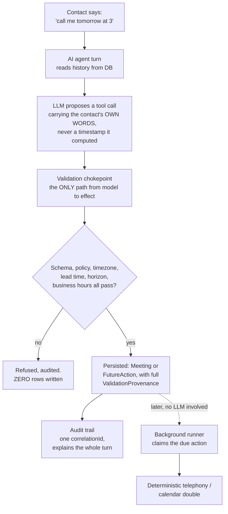
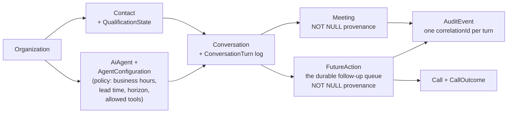

# Schedule AI Voice — Founder Review Package

**Mission:** MISSION-48d6ff04 · **Branch under review:** `task/MISSION-48d6ff04-INTEGRATOR` · **Verdict:** COMPLETED (0 unresolved findings) · as of 2026-09-23 · prepared by the Autonomous Development Team's Coordinator/review process

This package is for founder review before promotion to `master`. Nothing here has been merged to `master` yet.

---

## 1. Run it yourself

Node 20+. No credentials, no network, no running services required for anything below.

```bash
git worktree list                          # confirm task/MISSION-48d6ff04-INTEGRATOR exists
cd .worktrees/MISSION-48d6ff04-INTEGRATOR   # or clone that branch fresh
npm install
npm run db:generate      # prisma generate; writes .env from .env.example if absent
npm run db:push          # applies prisma/schema.prisma to ./prisma/dev.db
npm run db:seed          # one Organization / User / AiAgent / Contact / CalendarConnection
# (or: npm run db:setup  — generate + push + seed in one command)

npm run slice:demo       # the whole slice, end to end, one command
npm run verify           # typecheck + full test suite
npm run qa:sweep         # the 601-scenario invariant sweep, with a report to .tmp/qa/
```

`OPENAI_API_KEY` is not required for any of the above — it is left empty in `.env.example`. Everything runs against a scripted model and deterministic provider doubles; the one live-OpenAI test skips cleanly when the key is absent.

### Manual smoke-test flow

`npm run slice:demo` (`src/app/sliceDemo.ts`) is the smoke test — it creates its own temporary SQLite file, seeds a world, and walks the full path with no state left behind (pass `--keep` to leave the database for inspection):

1. Seeds a `Contact` in `America/New_York` with a persisted `Conversation`.
2. Feeds the scripted model the contact's utterance: *"Can you call me back tomorrow afternoon at 3?"*
3. The model proposes `schedule_followup` carrying those exact words, not a timestamp it computed itself.
4. Application code resolves and validates the datetime deterministically against a `FixedClock` and the persisted `AgentConfiguration` policy — nine ordered checks.
5. A `FutureAction` is persisted: correct UTC instant, the contact's own timezone, a non-empty `ValidationProvenance`.
6. The clock is advanced past the promised time; one `DueActionRunner` pass claims and dispatches the callback through the deterministic telephony double — on the same `correlationId` as the turn that made the promise.
7. An adversarial follow-up turn is sent and refused, writing zero domain rows.
8. The full audit chain is printed in order, then the five questions it must answer: what was said, what was decided, what tool was called, what was validated, what was persisted.

It cannot call a phone, write to a calendar, or spend money — every external dependency is a deterministic double (`createProviderRegistry` throws rather than silently falling back if asked for a real vendor).

---

## 2. Architecture, for a founder

One sentence: **the LLM reasons and converses; application code owns state and decides what actually happens.** The model never writes to the database, never dials a phone, and never gets the final word on a date or time.



**Why it's built this way:** a guardrail that lives only in a prompt is one the model can talk itself out of. Every rule ("never invent availability," "nothing is booked until the database says it is," "never phone outside business hours") is backed by code that makes the bad outcome structurally impossible, not just discouraged — and each one has a test proving it.

**The layers, and why they're separate:**

| Layer | Owns | Cannot do |
|---|---|---|
| `src/agent/` | The prompt, the nine tools, the dispatcher (the chokepoint), the turn loop | Write to the database directly, or call a provider directly |
| `src/scheduling/` + `src/followup/` | Resolving "tomorrow at 3" into a real, validated instant; the durable follow-up queue | Trust anything the model asserts about dates without re-deriving it |
| `src/domain/` | Entities, enums, the shape of a validation receipt | Import a vendor SDK |
| `src/db/` | Prisma repositories — the only code that touches the database | Skip writing the validation receipt |
| `src/ports/` + `src/providers/` | The seams to the outside world (Clock, Availability, Calendar, Telephony, LLM) and today's deterministic stand-ins for them | Reach a real vendor — asking for one throws, on purpose |

**The one enforced vendor boundary:** exactly one file in the entire codebase (`src/llm/openAiLlmProvider.ts`) is allowed to import the OpenAI SDK — checked by a dedicated test that scans all of `src/`, not just documented. Swapping in a real phone or calendar vendor later means writing one new adapter behind an existing port; it does not touch `src/agent`, `src/scheduling`, or `src/domain`.

---

## 3. Data model

18 Prisma models, one committed migration, SQLite for this mission (Postgres is a datasource-only change — see § 7). Everything hangs off `Organization` so multi-tenancy is a schema property, not a convention (though nothing yet *enforces* it — see § 7).



**The backbone, in words:** an `Organization` owns `Contact`s and `AiAgent`s. A `Contact` and an `AiAgent` (at a pinned `AgentConfiguration` version) have a `Conversation`, which is an ordered, gap-free log of `ConversationTurn` rows — the model's context is rebuilt from these every turn, never cached. A validated tool call produces either a `Meeting` or a `FutureAction`; both carry a `validationProvenanceJson` column that is `NOT NULL` **and** structurally validated on write, so a scheduling decision can never exist with no record of what justified it. A `FutureAction` that comes due dispatches a `Call`, which gets one `CallOutcome`. Every one of these writes also produces `AuditEvent` rows sharing one `correlationId` per agent turn.

| Entity | Purpose | Notable fields / relationships |
|---|---|---|
| `Organization` | Tenant root | Everything else has an `organizationId` |
| `User` | Human operator | No auth fields — exists only so `Lead`/`Task` have a real owner FK (§ 7) |
| `AiAgent` / `AgentConfiguration` | A configured persona + its **immutable, versioned** policy | Business hours, min lead time, max horizon, allowed tools — read from here, never from the model or a constant |
| `Contact` | A real person the platform may call | E.164 phone (app-validated), **required** IANA timezone, `isDecisionMaker` |
| `Lead` | A sales opportunity on a Contact | Status enum, owner FK |
| `QualificationState` | Current qualification verdict | Stores `rawScore`, `cappedScore` **and** effective `score` separately — the decision-maker cap is visible in the data, not implied |
| `Conversation` / `ConversationTurn` | Durable conversation | `@@unique([conversationId, index])` — turn order is a DB invariant, not an array position |
| `Meeting` | A scheduled meeting | `validationProvenanceJson` `NOT NULL`; unique `idempotencyKey` |
| `FutureAction` | A durable promise to act later (the follow-up engine) | `scheduledForUtc`, `timezone`, lease/attempt columns for crash-safe claiming, unique `idempotencyKey` |
| `Call` / `CallOutcome` | A dispatched call and its result | Vendor identity confined to `providerName`/`providerCallId` — no vendor type ever enters the domain |
| `CalendarConnection` | A calendar the platform may read/write | Stores **no OAuth tokens** — deferred pending a secrets decision (§ 7) |
| `Task` | Work for a human | Can be raised directly or materialised from an `INTERNAL_TASK` FutureAction |
| `AuditEvent` | Append-only audit trail | `@@unique([correlationId, sequence])` — the chain replays in the exact order it happened |

Two conventions worth knowing before reading the code: domain entities are **not** Prisma rows (instants are ISO-8601 UTC strings, enums are union types — `src/db/mappers.ts` is the only crossing point); and enum columns are plain `String` because Prisma's SQLite connector can't express `enum` — the permitted values live once in `src/domain/enums.ts`.

---

## 4. The two QA defects, in detail

Both were found by independent QA reproducing real behavior against the live integrated stack — not by reading code, and not by trusting the test suite. Both are now fixed, with a regression test that would fail again if either fix were reverted.

### 4.1 The clock-read race (found round 0)

**Root cause.** The dispatcher validated a proposed datetime once, at the chokepoint, pinning `nowUtc` for that turn. But the *services* that actually persisted the `Meeting`/`FutureAction` row (`meetingSchedulingService.ts`, `futureActionService.ts`) received only the model's raw string and independently called `this.clock.nowUtc()` again, **re-resolving** it a second time. Every test used a `FixedClock` (same value on every read), so the two resolutions could never disagree — the bug was invisible to the entire suite by construction.

**Concrete impact, reproduced against a real (advancing) clock:** a request straddling local midnight ("tomorrow afternoon at 3" made a tenth of a second before the contact's own local midnight) resolved to *the 4th* at the chokepoint and *the 5th* at the service — a full 24-hour disagreement between what the audit trail says was validated and what was actually persisted. A secondary consequence: because the idempotency key was derived from the chokepoint's resolution while the row was written at the service's, a retried "in 45 minutes" request produced **two separate rows** — the contact would have been called twice.

**The fix.** The chokepoint's already-validated `ResolvedSlot` and its `ValidationProvenance` are now threaded through to the services (`ctx.nowUtc`, `input.validatedSlot`) instead of being thrown away, so there is exactly one resolution per turn. As defense in depth, a new `assertResolutionsAgree()` guard still re-derives the slot at the service layer and **throws**, persisting nothing, if it ever disagrees with the chokepoint — so a future regression fails loudly instead of silently drifting again.

**Regression coverage.** A new `AdvancingClock` test helper (a clock whose reads genuinely advance, unlike every other test's `FixedClock`) backs `tests/e2e/pinnedNow.test.ts` and `tests/scheduling/pinnedSlot.test.ts`, specifically so this class of bug can never hide behind a fixed clock again.

### 4.2 The timezone-override / business-hours bypass (found round 1) — the more serious of the two

**Root cause.** Every time-bearing tool accepts an optional, model-supplied `timezone` argument — a legitimate feature ("I'm in Denver this week" really does change which instant "10am" names). The bug was that this same value also decided the **business-hours window** the instant was checked against, via `businessHoursTimezone(policy, slotTimezone)`. Because the seeded policy pinned no timezone of its own, the check fell through to whatever zone the model asserted — so the model could pick a zone in which a harmful instant looked like office hours, and the guardrail would agree with it.

**Concrete impact, reproduced against the real stack, with a control:** contact `Jordan Prospect`, `Contact.timezone = America/New_York`, policy 09:00–17:00. Asking plainly for *"today at 11:30pm"* was correctly refused (`OUTSIDE_BUSINESS_HOURS`). Asking for *"tomorrow at 10am"* **with `timezone: Asia/Kolkata`** — the same wall-clock instant, 23:30 in New York — was **accepted**, with `business_hours: passed: true` recorded in the provenance. Advancing the clock past that instant and running the due-action pass made `DueActionRunner` actually place a call (through the deterministic double) to a US number at 23:30 their local time. The same root cause let a meeting be booked at midnight New York time via a `timezone: Asia/Tokyo` override.

**The fix.** The business-hours window is now resolved by `businessHoursAnchor()` from **persisted data only** — `BusinessHoursPolicy.timezone`, else `Contact.timezone`, else `AgentConfiguration.defaultTimezone` — and the function takes **no slot-timezone parameter at all**, so there is no argument through which a model-supplied value could reach it. `persistedContactTimezone` is now a *required* field on the validator input, so a future call site that forgets to pass it fails `npm run typecheck` rather than silently reopening the hole. The old, exploitable `businessHoursTimezone()` was deleted outright, not deprecated — its signature *was* the bug. The override itself is kept (a Denver-based contact's "10am" is still read as 10am Denver and still bookable) — only the business-hours judgement was anchored.

**Regression coverage.** `INV-14` in the 601-scenario sweep re-checks every persisted `Meeting`/`FutureAction` against `Contact.timezone` off the row (not the slot's agreed zone), across the model-asserted-timezone axis. `tests/e2e/timezoneOverride.test.ts` pairs every refusal case with a control that proves the override still works for its legitimate purpose.

**A related, smaller defect fixed in the same QA round:** the minimum-lead-time check rounded the true lead to the nearest minute *before* comparing it to the policy minimum, letting up to a 30-second shortfall through, and then wrote the rounded (and therefore false) figure into the audit receipt. Now compared in milliseconds and the receipt records the true lead to sub-minute precision. Covered by `LEAD_TIME_BOUNDARY_CASES`, which deliberately uses sub-minute instants that the sweep's normal `now` axis does not.

---

## 5. Validation evidence

Everything below was re-run **fresh, by this review**, inside the same container the mission itself built in (`/workspace/.worktrees/MISSION-48d6ff04-INTEGRATOR`) — not copied from the QA agent's self-report.

| Check | Command | Result |
|---|---|---|
| Typecheck | `npm run typecheck` | **Exit 0**, no errors |
| Build | `npm run build` (`tsc -p tsconfig.json`) | **Exit 0** |
| Tests | `npm run test` (vitest) | **500 passed, 2 skipped**, 36/37 test files passed, 1 file skipped (the live-OpenAI test, which skips cleanly with no key) |
| Invariant sweep | `npm run qa:sweep` | **601 scenarios, 2,791 applicable checks (7,212 evaluated), 0 violations, 0 network attempts — RESULT: PASS** |
| Determinism | `npm run qa:sweep -- --determinism` | **PASS** — a second full run produced byte-identical classifications for every scenario id |
| Migration reproducibility | `prisma migrate deploy` against a throwaway database | Applied cleanly from the one committed migration (`20260923082321_init`) |
| Lint | — | **No lint script exists in this project** (`package.json` has no `lint` entry, no ESLint config present). Not run because there is nothing to run — flagged here rather than silently skipped. |
| Independent QA | 2 rounds via the AutonomousDevTeam QA task, both **re-verified by this review** | Round 0 and round 1 findings above (§ 4) were reproduced, fixed, and the fixes are covered by dedicated regression tests, not just re-asserted |

**Outcome distribution inside the sweep:** 332 REJECTED, 259 PERSISTED, 10 ACCEPTED_NO_WRITE — all 13 declared `ValidationErrorCode`s exercised (`OUTSIDE_BUSINESS_HOURS` 176, `INVALID_FORMAT` 50, `CONFLICT_WITH_BUSY_INTERVAL` 20, `BEYOND_HORIZON` 17, `BELOW_MIN_LEAD_TIME` 16, plus the rest).

**What the sweep is explicit about NOT covering** (printed by its own report, not omitted): the full Cartesian product of every axis (>800,000 cases — named families cross each axis exhaustively at least once, not every axis with every other); DST-gap/ambiguous times reached via natural language rather than explicit ISO input; `reschedule_meeting`, `cancel_meeting` on a real meeting, `record_call_outcome`, `transfer_to_human`, `get_contact_context` (covered by sibling suites, not this sweep); a business-hours policy that pins its own timezone (covered by a unit test); `DueActionRunner` execution itself (claim/lease/dispatch/retry — proved by its own restart/backoff test suite); concurrency (a dedicated test, not swept); and the live OpenAI provider (every scenario runs the scripted model).

---

## 6. What was reused from the legacy Alta project

**Important caveat, disclosed by the build team itself and confirmed by this review:** the containerized agents could not actually read `C:\Users\afiks\AI_Scheduling_Agent_Legacy_Export\` — that path was never mounted into their Linux execution environment (`/mnt/c` does not exist there), and they checked for it twice. `docs/LEGACY_LESSONS.md` is therefore written entirely from **the legacy description in the mission brief text**, not from the actual legacy files, and says so at the top rather than pretending otherwise. Nothing here is fabricated or misattributed — it's an honest gap worth knowing about, not a broken promise: the mission brief itself was already a thorough summary written after reading the real legacy project directly.

With that caveat, four ideas were deliberately **re-expressed, not copied**:

1. **The qualification rubric and its decision-maker hard cap.** Re-implemented as a pure, versioned function (five weighted factors, `NON_DECISION_MAKER_SCORE_CEILING = 60`) — improved on the legacy version by applying the cap from the **persisted** `Contact.isDecisionMaker` row rather than anything the model asserts mid-call, and by storing `rawScore` and `cappedScore` separately so the cap is visible in the data.
2. **Never-fabricate prompt guardrails.** Re-expressed as named, versioned prompt clauses — but every clause names, in code, the actual mechanism that backs it ("nothing is booked until a tool says it is" is backed by the tool returning the persisted row, not by the instruction alone). The explicit principle carried forward: **the prompt doesn't enforce anything; the dispatcher does.**
3. **Natural-language booking parsing.** Re-implemented with a broader grammar than described in the brief, with the same spirit: the model passes the contact's *own words* through untouched, and the resolver refuses rather than guesses on anything ambiguous.
4. **The invariant-sweep QA philosophy — the most directly carried-forward idea.** The legacy harness ran 538 scenarios asserting properties across a matrix rather than one-off examples; this slice's `tests/invariants/` does the same thing for its own scope: 601 scenarios, 12 invariants, with additions the legacy harness didn't have (non-vacuity guards, independent Luxon oracles instead of re-calling the system's own functions, and a determinism check that runs the whole corpus twice).

---

## 7. Everything intentionally not implemented yet

All of the below have a **port and a working deterministic double** in the architecture — going to production means a real commercial/security decision, not more engineering.

| Not built | Today | What's needed |
|---|---|---|
| **Real telephony** | `DeterministicTelephonyProvider` dispatches a scripted outcome, imports no transport | An account with Twilio/Telnyx/Vonage/Vapi/Retell, a purchased number, per-minute spend — and a **real-time media path**, which is entirely absent: this slice *dispatches* a call, it does not carry audio (streaming STT/TTS/barge-in is a separate build) |
| **Real calendar integration** | `DeterministicCalendarProvider` reports `canInvite: false` on purpose | A Google Cloud project or Microsoft Entra app registration, OAuth consent + verification |
| **A hosted database** | File-based SQLite | Managed Postgres, with a region/data-residency decision (this DB holds names, phone numbers, and transcripts) |
| **Secrets management** | A git-ignored `.env`, `OPENAI_API_KEY` empty | A real secrets manager (AWS/GCP/Vault/Doppler) — gates calendar OAuth specifically: `CalendarConnection` will not store a token until this is decided |
| **OpenAI spend** | No key present anywhere in the repo; the entire suite is green without one | A funded account, spend ceiling, a zero-retention/no-training decision (transcripts are customer PII), a pinned model version |
| **Authentication / multi-tenancy enforcement** — the largest gap | Every table has `organizationId`, but **nothing stops a caller from passing a different one**; no passwords, sessions, or API keys | An HTTP surface plus real auth. No live exposure today only because there is no HTTP surface at all yet |
| **An HTTP API or a UI** | This slice is driven entirely by its own composition root (`npm run slice:demo`) | A web/API layer — not started |
| **Webhook-driven call completion** | A non-terminal telephony status (`QUEUED`/`RINGING`/`IN_PROGRESS`) just leaves the action due again | Real webhook handling from the chosen telephony vendor |
| **Contact de-duplication policy** | Same-number contacts are indexed, not merged — deliberately, since merging silently combines two people's history | A product decision on what "same person" means |

**Stated with equal weight, so it isn't missed:** no paid service was signed up for, no credential was created or committed, no real phone number was dialled, no real calendar was written to, and no message was sent to any real person, at any point in this mission.

---

## 8. Recommended next 3 milestones — **not started, for your decision**

1. **Authentication, multi-tenancy enforcement, and a real HTTP API surface.** Right now nothing stops a caller from passing a different `organizationId` — there's no live exposure only because there's no HTTP surface at all yet. This is the precondition for everything else being safely usable by more than one person, and it's cheapest to add now, before more surface area exists to retrofit it onto.
2. **Real calendar integration (Google Calendar and/or Microsoft Graph).** The port and a working deterministic double already exist; this is mostly OAuth app registration, consent-screen verification, and wiring a real adapter behind `CalendarProvider` — lower regulatory complexity than telephony, and it proves the "swap the double for a real vendor" pattern before the harder one.
3. **Real telephony with an actual media path.** The largest remaining piece: a vendor account (Twilio/Telnyx/Vonage/Vapi/Retell), a purchased number, and — separately from just dispatching a call — streaming speech-to-text/text-to-speech and barge-in handling for a live conversation. Also carries the regulatory work (consent, do-not-call scrubbing, AI-disclosure requirements) that isn't an engineering decision at all.

A secrets-management decision (§ 7) is a dependency of milestone 2 specifically — `CalendarConnection` will not store an OAuth token until one exists.

**These are recommendations only. None of them have been started.**

---

## 9. Merge-readiness checklist

Every line below was checked directly by this review (`git status`, a fresh `npm run typecheck`/`build`/`test`/`qa:sweep`/`--determinism`, a fresh migration against a throwaway database, a secrets grep, and a diff of the legacy project's `git status` against its state before this mission began), not copied from the mission's own self-report.

```
READY_TO_MERGE:
- integrated branch clean: YES
- tests green: YES              (500 passed, 2 skipped — the skipped test is the live-OpenAI
                                  test, which is designed to skip without a key)
- QA complete: YES               (2 rounds; round 2 found 0 new findings)
- unresolved QA findings: 0
- migrations reproducible: YES
- documentation current: YES     (README, docs/ARCHITECTURE.md, docs/DECISIONS.md,
                                  docs/LEGACY_LESSONS.md, and the three *_CONTRACT.md
                                  files all checked against the actual code)
- secrets committed: NO
- legacy project modified: NO    (both C:\Users\afiks\ai-voice-sales-agent and
                                  C:\Users\afiks\AI_Scheduling_Agent_Legacy_Export
                                  verified unchanged; the container never had
                                  filesystem access to either)
- real external communications performed: NO   (every telephony/calendar call in
                                  this mission went through a deterministic double;
                                  createProviderRegistry throws rather than falling
                                  back if asked for a real vendor)
```

**Everything on this list is YES/NO/0 in the direction that clears a merge.** The one open item is not on this checklist because it isn't a merge blocker — it's the honest scope gap in § 7: no auth, no HTTP surface, no real telephony or calendar yet. This is a first vertical slice merging into `master` as a first vertical slice, not a claim that the product is done.

---

## 10. Known limitations (distinct from § 7's unbuilt features)

Things that exist and work, but with a stated edge:

- **The invariant sweep is honest about its own gaps**, and prints them on every run: it doesn't cross every axis with every other (the full product would be >800,000 cases); DST-gap/ambiguous times are only swept as explicit ISO input, not via the natural-language path; a business-hours policy that pins its own timezone is covered by a unit test, not the sweep; `DueActionRunner` execution itself and concurrent idempotency races are covered by dedicated tests, not re-swept per scenario; and no scenario in the sweep ever runs the real OpenAI provider.
- **SQLite is single-writer and file-based.** `DueActionRunner` is *safe* to run in multiple processes (the claim is an atomic lease and an expired lease is reclaimable), but it has not been run that way at scale. No metrics endpoint, no structured log shipping, no alerting yet.
- **Webhook-driven call completion is missing.** A non-terminal telephony status (`QUEUED`/`RINGING`/`IN_PROGRESS`) currently just leaves the action due again rather than being resolved by a provider callback.
- **Contact de-duplication is deliberately unresolved.** Same phone number, different organization context, is indexed but not unique — merging is a product decision, not made yet.
- **This review's own limitation:** the legacy Alta project could not be read from inside the build container (§ 6) — the legacy-reuse section is accurate to the mission brief, not independently re-verified against the original legacy files during the build itself.

---

**Generated file:** `C:\Users\afiks\ScheduleAIVoice\.worktrees\MISSION-48d6ff04-INTEGRATOR\docs\FOUNDER_REVIEW.md` (branch `task/MISSION-48d6ff04-INTEGRATOR`)

FOUNDER_REVIEW_READY
